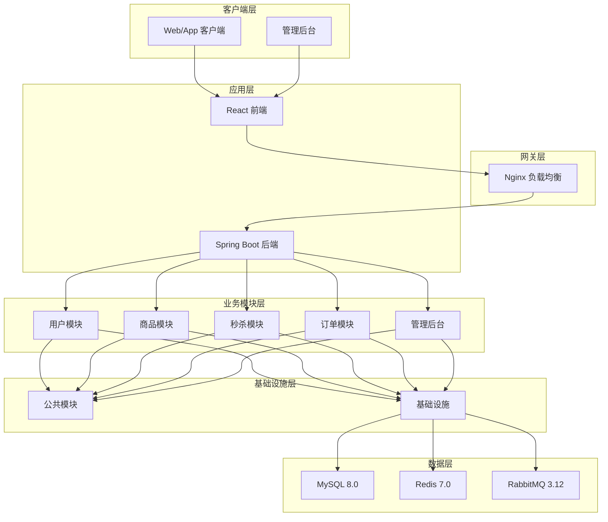
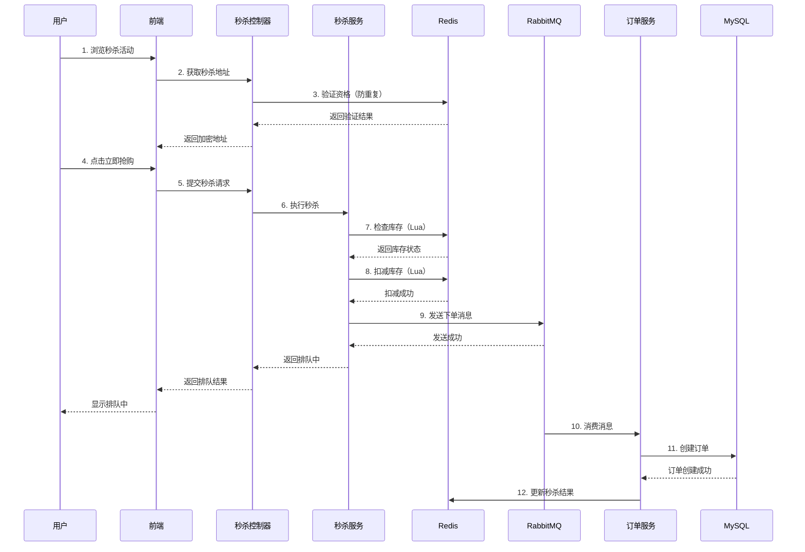
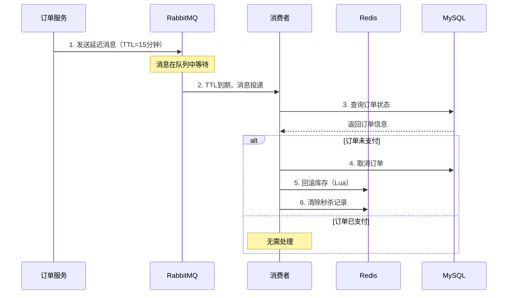
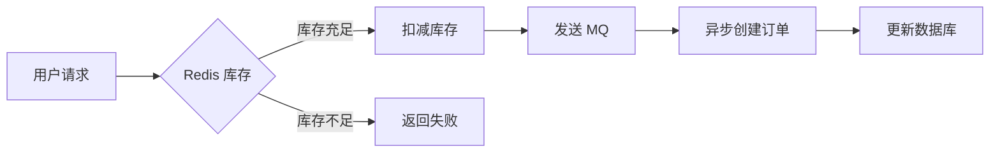

# 电商秒杀系统

<p align="center">
  
  
  
  
  
</p>

<p align="center">
  <b>基于 Spring Boot + React 的高并发电商秒杀系统</b>
</p>

---

## 项目简介

这是一个完整的高并发电商秒杀系统，采用前后端分离架构，整合了多种主流技术栈，旨在解决秒杀场景下的高并发、高可用、数据一致性等技术挑战。

### 核心特性

- **高并发处理**：Redis 预扣库存 + 消息队列异步下单，支撑万级并发
- **防超卖机制**：Redis 原子操作 + Lua 脚本保证库存扣减的原子性
- **接口防刷**：限流控制防止恶意请求
- **订单超时处理**：RabbitMQ 延迟队列实现订单自动取消
- **分布式锁**：防止并发场景下的数据竞争
- **JWT 认证**：无状态的 Token 认证机制
- **RBAC 权限**：基于角色的访问控制，支持多角色管理

---

## 系统架构



---

## 技术栈

### 后端技术栈

| 技术 | 版本 | 用途 |
|-----|------|------|
| Java | 21 | 编程语言 |
| Spring Boot | 3.2.5 | 应用框架 |
| MyBatis-Plus | 3.5.6 | ORM 框架 |
| MySQL | 8.0.33 | 关系型数据库 |
| Druid | 1.2.22 | 数据库连接池 |
| Redis | 7.0 | 缓存、分布式锁、限流 |
| RabbitMQ | 3.12 | 消息队列、延迟队列 |
| JWT | 0.12.5 | Token 认证 |
| Maven | 3.9+ | 构建工具 |

### 前端技术栈

| 技术 | 版本 | 用途 |
|-----|------|------|
| React | 18 | 前端框架 |
| TypeScript | 5.0 | 类型系统 |
| Vite | 8.0 | 构建工具 |
| Ant Design Mobile | 5.42 | 移动端 UI |
| Ant Design | 6.3 | 管理后台 UI |
| React Router | 7.14 | 路由管理 |
| Zustand | 5.0 | 状态管理 |
| Axios | 1.15 | HTTP 客户端 |

---

## 项目结构

```
电商系统/
├── seckill-parent/              # 后端项目（Maven 多模块）
│   ├── seckill-common/         # 公共模块 - 工具类、常量、响应封装
│   ├── seckill-infrastructure/ # 基础设施 - 中间件配置
│   ├── seckill-user/           # 用户模块 - 注册、登录、个人信息
│   ├── seckill-goods/          # 商品模块 - 商品、分类、秒杀活动
│   ├── seckill-order/          # 订单模块 - 订单、支付、超时处理
│   ├── seckill-admin/          # 管理后台 - 权限、数据统计
│   ├── seckill-application/    # 应用入口 - 启动类、配置文件
│   ├── docker-compose.yml      # Docker 编排
│   └── pom.xml                 # 父 POM
│
├── seckill-frontend/            # 前端项目（React + TypeScript）
│   ├── src/
│   │   ├── api/               # API 接口
│   │   ├── components/        # 通用组件
│   │   ├── layouts/           # 布局组件
│   │   ├── pages/             # 页面组件
│   │   ├── router/            # 路由配置
│   │   ├── store/             # 状态管理
│   │   └── utils/             # 工具函数
│   ├── package.json
│   └── vite.config.ts
│
├── docker/                      # Docker 配置
│   ├── rabbitmq/              # RabbitMQ 配置
│   └── redis/                 # Redis 配置
│
├── docker-compose.yml           # 全局 Docker 编排
└── README.md                    # 项目总览文档
```

---

## 模块说明

### 后端模块

| 模块 | 说明 | 核心功能 |
|-----|------|---------|
| `seckill-common` | 公共模块 | 工具类、常量、统一响应、异常定义、JWT、雪花算法 |
| `seckill-infrastructure` | 基础设施层 | MySQL、Redis、RabbitMQ、MyBatis-Plus 配置 |
| `seckill-user` | 用户模块 | 用户注册、登录、个人信息管理 |
| `seckill-goods` | 商品模块 | 商品管理、分类管理、秒杀活动管理、预热机制 |
| `seckill-order` | 订单模块 | 订单创建、管理、超时取消、支付处理、库存回滚 |
| `seckill-admin` | 管理后台模块 | 管理员认证、RBAC 权限、数据统计、商品/订单/用户管理 |
| `seckill-application` | 应用启动入口 | 整合所有模块，提供统一启动入口 |

### 前端模块

| 模块 | 说明 |
|-----|------|
| `用户端` | 首页、商品列表、秒杀活动、订单管理、个人中心 |
| `管理后台` | 仪表盘、商品管理、秒杀管理、订单管理、用户管理 |

---

## 快速开始

### 环境要求

- JDK 21+
- Node.js 18+
- Maven 3.9+
- Docker & Docker Compose

### 1. 克隆项目

```bash
git clone <repository-url>
cd 电商系统
```

### 2. 启动基础设施

```bash
# 使用 Docker Compose 启动 MySQL、Redis、RabbitMQ
docker-compose up -d

# 查看服务状态
docker-compose ps
```

### 3. 初始化数据库

```bash
cd seckill-parent
./init.sh
```

### 4. 启动后端服务

```bash
# 编译项目
mvn clean install -DskipTests

# 启动应用
cd seckill-application
mvn spring-boot:run
```

后端服务启动后访问：
- API 文档：http://localhost:8080/doc.html
- Druid 监控：http://localhost:8080/druid（账号：admin/admin）

### 5. 启动前端服务

```bash
cd seckill-frontend
npm install
npm run dev
```

前端服务启动后访问：http://localhost:5173/

---

## 核心流程

### 秒杀流程



### 订单超时处理流程



---

## 技术亮点

### 1. 高并发秒杀方案



- **Redis 预扣库存**：避免数据库压力，支持高并发
- **Lua 原子操作**：保证库存扣减的原子性，防止超卖
- **消息队列异步**：削峰填谷，保护数据库

### 2. 防重复秒杀

```java
// 使用 Redis Set 存储已秒杀用户
SADD seckill:done:{activityId}:{goodsId} {userId}

// 秒杀前检查
SISMEMBER seckill:done:{activityId}:{goodsId} {userId}
```

### 3. 接口限流

```java
// 滑动窗口限流
String key = "rate:limit:" + uri + ":" + userId;
Long count = redisTemplate.opsForValue().increment(key, 1);
redisTemplate.expire(key, 1, TimeUnit.SECONDS);

if (count > limit) {
    throw new BusinessException("请求过于频繁");
}
```

### 4. 分布式锁

```java
// Redisson 分布式锁
RLock lock = redissonClient.getLock("lock:order:" + orderNo);
try {
    boolean locked = lock.tryLock(3, 10, TimeUnit.SECONDS);
    if (locked) {
        // 执行业务逻辑
    }
} finally {
    lock.unlock();
}
```

---

## 项目文档

### 后端文档

| 模块 | 文档链接 |
|-----|---------|
| 父模块 | [seckill-parent/README.md](./seckill-parent/README.md) |
| 公共模块 | [seckill-common/README.md](./seckill-parent/seckill-common/README.md) |
| 基础设施 | [seckill-infrastructure/README.md](./seckill-parent/seckill-infrastructure/README.md) |
| 商品模块 | [seckill-goods/README.md](./seckill-parent/seckill-goods/README.md) |
| 订单模块 | [seckill-order/README.md](./seckill-parent/seckill-order/README.md) |
| 管理后台 | [seckill-admin/README.md](./seckill-parent/seckill-admin/README.md) |
| 应用入口 | [seckill-application/README.md](./seckill-parent/seckill-application/README.md) |

### 前端文档

| 文档 | 链接 |
|-----|------|
| 前端项目说明 | [seckill-frontend/README.md](./seckill-frontend/README.md) |

---

## 开发规范

### Git 分支管理

```
main        # 生产分支
├── develop # 开发分支
│   ├── feature/user-module    # 功能分支
│   ├── feature/goods-module
│   └── feature/order-module
└── hotfix  # 紧急修复分支
```

### 代码规范

- **Java**：遵循 Alibaba Java Coding Guidelines
- **TypeScript**：使用 ESLint + Prettier
- **提交规范**：遵循 Conventional Commits

```bash
# 提交示例
git commit -m "feat: 添加用户登录功能"
git commit -m "fix: 修复订单超时处理问题"
git commit -m "docs: 更新 API 文档"
```

---

## 测试

### 后端测试

```bash
cd seckill-parent

# 运行所有测试
mvn test

# 运行指定模块测试
cd seckill-order
mvn test

# 生成测试报告
mvn jacoco:report
```

### 前端测试

```bash
cd seckill-frontend

# 运行 ESLint
npm run lint

# 构建测试
npm run build
```

---

## 部署

### Docker 部署

```bash
# 构建镜像
docker build -t seckill-backend ./seckill-parent
docker build -t seckill-frontend ./seckill-frontend

# 启动服务
docker-compose up -d
```

### 生产环境部署

```bash
# 1. 打包后端
mvn clean package -DskipTests

# 2. 打包前端
cd seckill-frontend
npm run build

# 3. 部署到服务器
scp seckill-application/target/*.jar user@server:/app/
scp -r seckill-frontend/dist user@server:/app/
```

---

## 性能优化

### 数据库优化

- 索引优化：为高频查询字段添加索引
- 连接池：Druid 连接池配置优化
- 读写分离：主从复制实现读写分离

### 缓存优化

- Redis 缓存：热点数据缓存
- 本地缓存：Caffeine 缓存配置
- 缓存穿透：布隆过滤器防止缓存穿透

### 前端优化

- 代码分割：路由懒加载
- 资源压缩：Gzip/Brotli 压缩
- CDN 加速：静态资源 CDN 部署

---

## 监控与运维

### 服务监控

| 服务 | 监控地址 | 账号 |
|-----|---------|------|
| Druid | http://localhost:8080/druid | admin/admin |
| RabbitMQ | http://localhost:15672 | admin/admin123 |

### 日志管理

```yaml
# 日志配置
logging:
  level:
    root: INFO
    com.seckill: DEBUG
  file:
    name: logs/seckill-system.log
```

---

## 贡献指南

1. Fork 本仓库
2. 创建特性分支 (`git checkout -b feature/AmazingFeature`)
3. 提交更改 (`git commit -m 'Add some AmazingFeature'`)
4. 推送到分支 (`git push origin feature/AmazingFeature`)
5. 打开 Pull Request

---

## 许可证

本项目采用 [Apache License 2.0](https://www.apache.org/licenses/LICENSE-2.0) 开源协议。

---

## 联系方式

- 项目维护者：Seckill Team
- 邮箱：support@seckill.com
- 问题反馈：请提交 GitHub Issue

---

## 致谢

感谢以下开源项目的支持：

- [Spring Boot](https://spring.io/projects/spring-boot)
- [React](https://react.dev/)
- [Ant Design](https://ant.design/)
- [MyBatis-Plus](https://baomidou.com/)
- [Redis](https://redis.io/)
- [RabbitMQ](https://www.rabbitmq.com/)

---

<p align="center">
  <b>如果这个项目对你有帮助，请给个 ⭐ Star 支持一下！</b>
</p>
