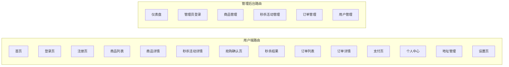

# 电商秒杀系统 - 前端项目结构

## 技术栈
- **框架**: React 18 + TypeScript
- **构建工具**: Vite
- **用户端 UI**: Ant Design Mobile
- **管理后台 UI**: Ant Design
- **路由**: React Router v6
- **状态管理**: Zustand
- **HTTP 客户端**: Axios
- **日期处理**: Dayjs

## 项目结构

```mermaid
graph TB
    subgraph seckill-frontend[前端项目]
        subgraph src[源代码目录]
            subgraph components[通用组件]
                Countdown[倒计时组件]
                SeckillCard[秒杀卡片组件]
                OrderCard[订单卡片组件]
                TabBar[底部导航组件]
            end
            
            subgraph layouts[布局组件]
                MobileLayout[移动端布局]
                AdminLayout[管理后台布局]
            end
            
            subgraph pages[页面]
                subgraph mobile[用户端页面]
                    Login[登录页]
                    Home[首页]
                    Orders[订单列表页]
                    Profile[个人中心页]
                    Register[注册页-待实现]
                    Goods[商品列表-待实现]
                    GoodsDetail[商品详情-待实现]
                    SeckillDetail[秒杀详情-待实现]
                    SeckillBuy[抢购确认-待实现]
                    SeckillResult[秒杀结果-待实现]
                    OrderDetail[订单详情-待实现]
                    Pay[支付页-待实现]
                    Address[地址管理-待实现]
                    Settings[设置页-待实现]
                end
                
                subgraph admin[管理后台页面]
                    Dashboard[仪表盘]
                    GoodsManage[商品管理-待实现]
                    SeckillManage[秒杀管理-待实现]
                    OrderManage[订单管理-待实现]
                    UserManage[用户管理-待实现]
                end
            end
            
            subgraph utils[工具模块]
                constants[常量定义]
                format[格式化工具]
            end
            
            subgraph store[状态管理]
                userStore[用户状态]
            end
            
            subgraph types[类型定义]
                index[类型定义文件]
            end
            
            styles[样式变量]
            router[路由配置]
            App[应用入口]
            main[主入口文件]
        end
    end

    subgraph 后端服务
        seckill-parent[秒杀系统后端]
    end
```



## 路由结构



## 设计规范

### 色彩系统
| 颜色 | 色值 | 用途 |
|------|------|------|
| 品牌主色 | `#FF4D4F` | 秒杀价格、促销标签 |
| 品牌辅色 | `#FF7A45` | 悬停状态、渐变过渡 |
| 成功色 | `#52C41A` | 成功提示、已完成状态 |
| 警告色 | `#FAAD14` | 警告提示、待处理状态 |
| 错误色 | `#FF4D4F` | 错误提示、失败状态 |
| 信息色 | `#1890FF` | 信息提示、链接 |

### 字体规范
- 中文字体: PingFang SC, Hiragino Sans GB, Microsoft YaHei
- 数字字体: SF Pro Display, Helvetica Neue, Arial

### 间距系统 (8px 基准)
- `xs`: 4px
- `sm`: 8px
- `md`: 16px
- `lg`: 24px
- `xl`: 32px
- `xxl`: 48px

## 启动项目

```bash
cd seckill-frontend
npm install
npm run dev
```

访问 http://localhost:5173/

## 下一步

1. 实现剩余的页面组件
2. 对接后端 API
3. 添加数据持久化
4. 实现用户认证流程
5. 添加表单验证
6. 完善秒杀核心流程
