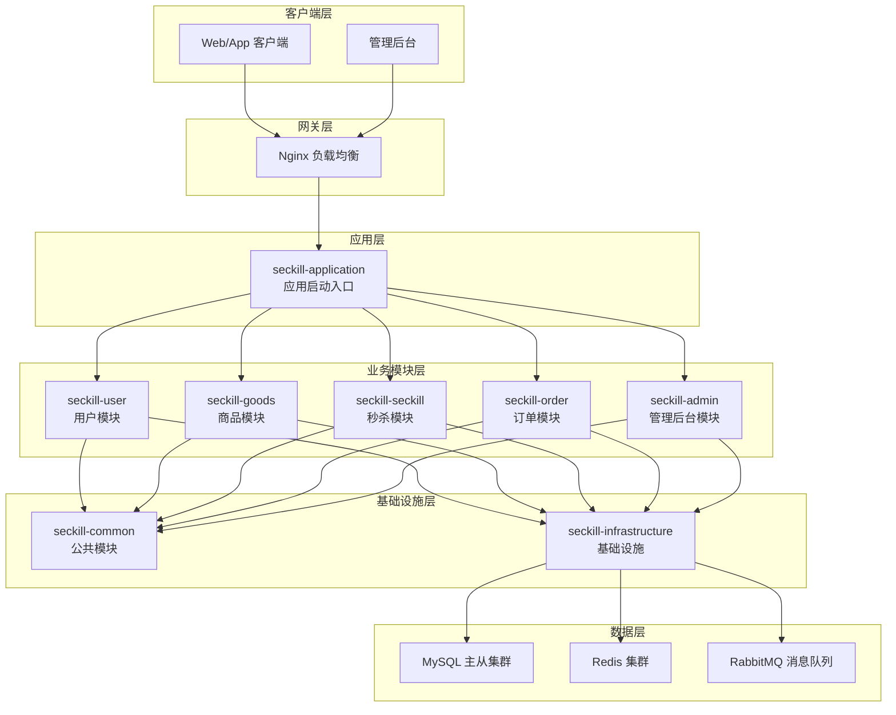
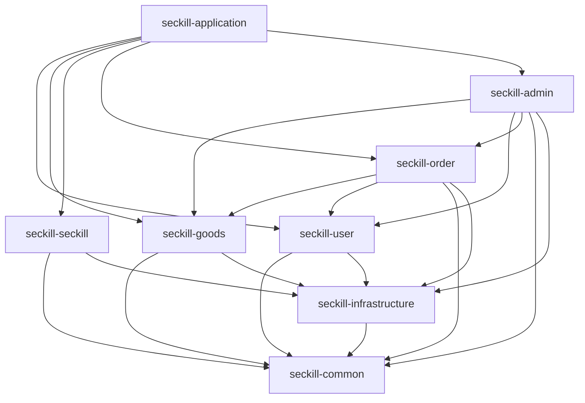
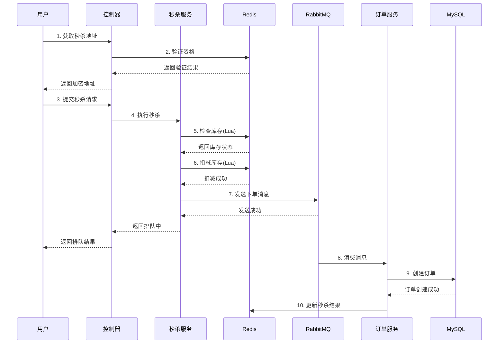
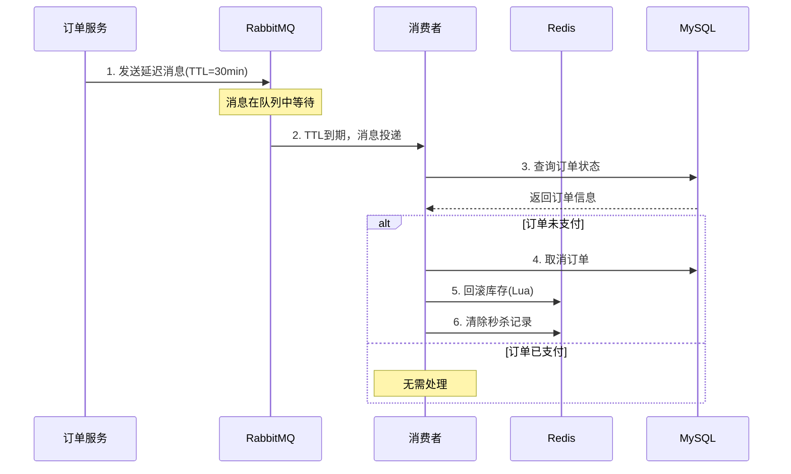

# 电商秒杀系统 - 项目根模块

## 项目概述

这是一个基于 **Spring Boot 3.2.5** 构建的高并发电商秒杀系统，采用模块化架构设计，整合了多种主流技术栈，旨在解决秒杀场景下的高并发、高可用、数据一致性等技术挑战。

### 核心特性

- **高并发处理**：Redis 预扣库存 + 消息队列异步下单
- **防超卖机制**：Redis 原子操作 + Lua 脚本保证库存扣减的原子性
- **接口防刷**：限流控制防止恶意请求
- **订单超时处理**：RabbitMQ 延迟队列实现订单自动取消
- **分布式锁**：防止并发场景下的数据竞争
- **JWT 认证**：无状态的 Token 认证机制

---

## 技术架构

### 系统架构图



### 模块依赖关系



---

## 模块说明

| 模块名称 | 说明 | 核心职责 |
|---------|------|---------|
| `seckill-common` | 公共模块 | 工具类、常量、统一响应、异常定义 |
| `seckill-infrastructure` | 基础设施层 | Redis、RabbitMQ、MyBatis-Plus 配置 |
| `seckill-user` | 用户模块 | 用户注册、登录、个人信息管理 |
| `seckill-goods` | 商品模块 | 商品管理、分类管理、秒杀活动管理 |
| `seckill-seckill` | 秒杀模块 | 秒杀核心逻辑、库存扣减、防重复秒杀 |
| `seckill-order` | 订单模块 | 订单创建、管理、超时取消、支付处理 |
| `seckill-admin` | 管理后台模块 | 商品管理、活动管理、用户管理、数据统计 |
| `seckill-application` | 应用启动入口 | 整合所有模块，提供统一启动入口 |

---

## 技术栈

### 核心技术

| 技术 | 版本 | 用途 |
|-----|------|------|
| Java | 21 | 编程语言 |
| Spring Boot | 3.2.5 | 应用框架 |
| MyBatis-Plus | 3.5.6 | ORM 框架 |
| MySQL | 8.0.33 | 关系型数据库 |
| Druid | 1.2.22 | 数据库连接池 |
| Redis | - | 缓存、分布式锁、限流 |
| RabbitMQ | - | 消息队列、延迟队列 |

### 工具类库

| 技术 | 版本 | 用途 |
|-----|------|------|
| JWT (jjwt) | 0.12.5 | Token 认证 |
| Fastjson2 | 2.0.49 | JSON 处理 |
| Hutool | 5.8.27 | 工具类库 |
| Lombok | 1.18.32 | 代码简化 |
| MapStruct | 1.5.5.Final | 对象映射 |
| Knife4j | 4.5.0 | API 文档 |

### 测试技术

| 技术 | 版本 | 用途 |
|-----|------|------|
| JUnit 5 | 5.10.2 | 单元测试 |
| Mockito | 5.16.0 | 模拟对象 |
| Jacoco | 0.8.13 | 代码覆盖率 |

---

## 项目结构

```
seckill-parent/
├── seckill-common/              # 公共模块
│   ├── constant/               # 常量定义
│   ├── dto/                    # 数据传输对象
│   ├── entity/                 # 基础实体
│   ├── enums/                  # 枚举定义
│   ├── exception/              # 异常定义
│   ├── result/                 # 统一响应
│   └── utils/                  # 工具类
│
├── seckill-infrastructure/      # 基础设施层
│   └── resources/
│       └── application-infrastructure.yml  # 中间件配置
│
├── seckill-user/               # 用户模块
│   ├── controller/             # 控制器
│   ├── service/                # 服务层
│   ├── mapper/                 # 数据访问层
│   └── entity/                 # 实体类
│
├── seckill-goods/              # 商品模块
│   ├── controller/             # 控制器
│   ├── service/                # 服务层
│   ├── mapper/                 # 数据访问层
│   ├── entity/                 # 实体类
│   └── task/                   # 定时任务
│
├── seckill-seckill/            # 秒杀模块
│   ├── controller/             # 控制器
│   ├── service/                # 服务层
│   └── mq/                     # 消息队列
│
├── seckill-order/              # 订单模块
│   ├── controller/             # 控制器
│   ├── service/                # 服务层
│   ├── mq/                     # 消息队列
│   └── resources/lua/          # Lua 脚本
│
├── seckill-admin/              # 管理后台模块
│   ├── controller/             # 控制器
│   ├── service/                # 服务层
│   └── mapper/                 # 数据访问层
│
├── seckill-application/         # 应用启动入口
│   ├── SeckillApplication.java  # 启动类
│   └── resources/
│       ├── application.yml      # 主配置
│       └── application-dev.yml  # 开发环境配置
│
├── pom.xml                     # 父 POM
├── docker-compose.yml          # Docker 编排
├── redis.conf                  # Redis 配置
└── init.sh                     # 初始化脚本
```

---

## 快速开始

### 环境要求

- JDK 21+
- Maven 3.9+
- MySQL 8.0+
- Redis 7.0+
- RabbitMQ 3.12+

### 1. 克隆项目

```bash
git clone <repository-url>
cd seckill-parent
```

### 2. 启动基础设施

```bash
# 使用 Docker Compose 启动 MySQL、Redis、RabbitMQ
docker-compose up -d
```

### 3. 初始化数据库

```bash
# 执行初始化脚本
./init.sh
```

### 4. 编译项目

```bash
mvn clean install -DskipTests
```

### 5. 启动应用

```bash
cd seckill-application
mvn spring-boot:run
```

### 6. 访问服务

- **API 文档**: http://localhost:8080/doc.html
- **Druid 监控**: http://localhost:8080/druid
- **应用服务**: http://localhost:8080

---

## 核心流程

### 秒杀流程



### 订单超时处理流程



---

## 配置说明

### 应用配置 (application.yml)

```yaml
server:
  port: 8080                    # 服务端口
  tomcat:
    threads:
      max: 500                  # 最大线程数
      min-spare: 50             # 最小空闲线程

spring:
  profiles:
    active: dev                 # 激活的配置文件

# Knife4j API 文档配置
knife4j:
  enable: true
  openapi:
    title: 电商秒杀系统 API 文档
    version: v1.0.0
```

### 开发环境配置 (application-dev.yml)

```yaml
spring:
  datasource:
    url: jdbc:mysql://localhost:3306/seckill_db
    username: root
    password: your_password

  data:
    redis:
      host: localhost
      port: 6379

  rabbitmq:
    host: localhost
    port: 5672
    username: guest
    password: guest
```

---

## 测试

### 运行单元测试

```bash
# 运行所有测试
mvn test

# 运行指定模块测试
cd seckill-goods
mvn test

# 生成测试报告
mvn jacoco:report
```

### 测试报告位置

- **Jacoco 覆盖率报告**: `target/site/jacoco/index.html`

---

## 部署

### 打包

```bash
mvn clean package -DskipTests
```

### 运行

```bash
java -jar seckill-application/target/seckill-application-1.0.0-SNAPSHOT.jar
```

### Docker 部署

```bash
# 构建镜像
docker build -t seckill-system .

# 运行容器
docker run -p 8080:8080 seckill-system
```

---

## 各模块详细文档

| 模块 | README 链接 |
|-----|------------|
| seckill-common | [查看详情](./seckill-common/README.md) |
| seckill-infrastructure | [查看详情](./seckill-infrastructure/README.md) |
| seckill-user | [查看详情](./seckill-user/README.md) |
| seckill-goods | [查看详情](./seckill-goods/README.md) |
| seckill-seckill | [查看详情](./seckill-seckill/README.md) |
| seckill-order | [查看详情](./seckill-order/README.md) |
| seckill-admin | [查看详情](./seckill-admin/README.md) |
| seckill-application | [查看详情](./seckill-application/README.md) |

---

## 贡献指南

1. Fork 本仓库
2. 创建特性分支 (`git checkout -b feature/AmazingFeature`)
3. 提交更改 (`git commit -m 'Add some AmazingFeature'`)
4. 推送到分支 (`git push origin feature/AmazingFeature`)
5. 打开 Pull Request

---

## 许可证

本项目采用 [Apache License 2.0](https://www.apache.org/licenses/LICENSE-2.0) 开源协议。

---

## 联系方式

- 项目维护者：Seckill Team
- 邮箱：support@seckill.com
- 问题反馈：请提交 GitHub Issue
