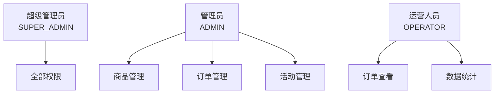
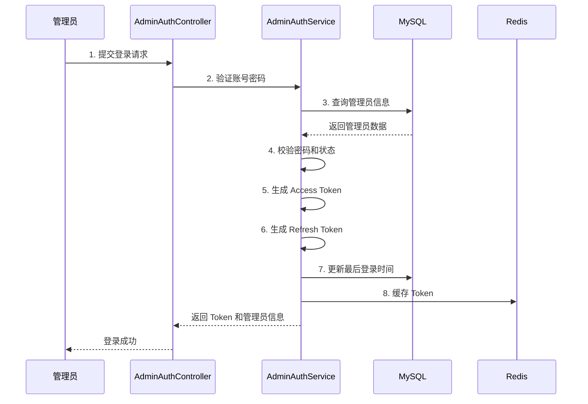

# seckill-admin 模块

## 模块概述

`seckill-admin` 是电商秒杀系统的**管理后台模块**，提供管理员认证、商品管理、订单管理、用户管理和数据统计等功能。该模块采用 RBAC（基于角色的访问控制）模型实现权限管理，支持超级管理员、管理员、运营人员三种角色。

### 核心职责

- 管理员认证与授权
- 商品管理（CRUD、上下架）
- 订单管理（查询、发货、取消）
- 用户管理（查询、禁用）
- 数据统计与可视化
- 秒杀活动管理

---

## 包结构说明

```
seckill-admin/
├── annotation/          # 自定义注解
│   └── RequireAdmin.java            # 管理员权限注解
├── config/              # 配置类
│   └── AdminWebMvcConfig.java       # Web MVC 配置
├── controller/          # 控制器层
│   ├── AdminAuthController.java     # 认证接口
│   ├── AdminGoodsController.java    # 商品管理接口
│   ├── AdminOrderController.java    # 订单管理接口
│   └── AdminUserController.java     # 用户管理接口
├── dto/                 # 数据传输对象
│   ├── order/
│   │   └── AdminOrderShipRequest.java   # 订单发货请求
│   ├── stats/
│   │   ├── SalesStatsResponse.java      # 销售统计响应
│   │   └── TopProductsResponse.java     # 热销商品响应
│   ├── user/
│   │   └── AdminUserListResponse.java   # 用户列表响应
│   ├── AdminLoginRequest.java       # 登录请求
│   └── AdminLoginResponse.java      # 登录响应
├── entity/              # 实体类
│   └── Admin.java                   # 管理员实体
├── enums/               # 枚举定义
│   └── AdminRoleEnum.java           # 管理员角色枚举
├── mapper/              # 数据访问层
│   ├── AdminMapper.java             # 管理员 Mapper
│   ├── AdminOrderQueryMapper.java   # 订单查询 Mapper
│   ├── AdminStatisticsMapper.java   # 统计查询 Mapper
│   └── AdminUserQueryMapper.java    # 用户查询 Mapper
└── service/             # 服务层
    ├── AdminAuthService.java        # 认证服务
    ├── AdminSeckillService.java     # 秒杀活动服务
    └── AdminStatisticsService.java  # 统计服务
```

---

## 权限模型

### RBAC 架构



### 角色权限矩阵

| 功能 | SUPER_ADMIN | ADMIN | OPERATOR |
|-----|-------------|-------|----------|
| 商品创建/修改/删除 | ✓ | ✓ | ✗ |
| 商品上下架 | ✓ | ✓ | ✗ |
| 订单查询 | ✓ | ✓ | ✓ |
| 订单发货 | ✓ | ✓ | ✗ |
| 订单取消 | ✓ | ✓ | ✗ |
| 用户查询 | ✓ | ✓ | ✓ |
| 用户禁用 | ✓ | ✓ | ✗ |
| 活动管理 | ✓ | ✓ | ✗ |
| 数据统计 | ✓ | ✓ | ✓ |
| 管理员管理 | ✓ | ✗ | ✗ |

### 权限注解使用

```java
@RestController
@RequestMapping("/api/admin/goods")
public class AdminGoodsController {

    // 超级管理员、管理员、运营人员均可查看
    @GetMapping
    @RequireAdmin(roles = {AdminRoleEnum.SUPER_ADMIN, AdminRoleEnum.ADMIN, AdminRoleEnum.OPERATOR})
    public Result<PageResult<AdminGoodsListResponse>> list(...) {
        return Result.success(goodsService.getAdminGoodsList(...));
    }

    // 仅超级管理员和管理员可创建
    @PostMapping
    @RequireAdmin(roles = {AdminRoleEnum.SUPER_ADMIN, AdminRoleEnum.ADMIN})
    public Result<Map<String, Long>> create(...) {
        Long goodsId = goodsService.createGoods(request);
        return Result.created(Map.of("goodsId", goodsId));
    }

    // 仅超级管理员可删除
    @DeleteMapping("/{id}")
    @RequireAdmin(roles = {AdminRoleEnum.SUPER_ADMIN})
    public Result<Void> delete(@PathVariable("id") Long goodsId) {
        goodsService.deleteGoods(goodsId);
        return Result.success();
    }
}
```

---

## 核心功能详解

### 1. 管理员认证

#### 管理员实体 (Admin)

```java
@Data
@TableName("t_admin")
public class Admin {
    private Long id;
    private String username;       // 登录账号
    private String password;       // 加密密码
    private String realName;       // 真实姓名
    private String role;           // 角色标识
    private Integer status;        // 状态：0-禁用，1-启用
    private LocalDateTime lastLoginTime;  // 最后登录时间
}
```

#### 登录流程



#### Token 机制

```java
public class AdminLoginResponse {
    private String accessToken;    // 访问令牌（30分钟有效）
    private String refreshToken;   // 刷新令牌（7天有效）
    private Long adminId;          // 管理员ID
    private String username;       // 用户名
    private String realName;       // 真实姓名
    private String role;           // 角色
}
```

---

### 2. 商品管理

#### 管理端商品列表

```java
@GetMapping
@RequireAdmin(roles = {AdminRoleEnum.SUPER_ADMIN, AdminRoleEnum.ADMIN, AdminRoleEnum.OPERATOR})
public Result<PageResult<AdminGoodsListResponse>> list(
        @RequestParam(required = false) Long categoryId,
        @RequestParam(required = false) String keyword,
        @RequestParam(required = false) Integer status,
        @RequestParam(required = false, defaultValue = "1") Long current,
        @RequestParam(required = false, defaultValue = "10") Long size) {
    return Result.success(goodsService.getAdminGoodsList(categoryId, keyword, status, current, size));
}
```

#### 商品操作权限控制

| 操作 | 请求方式 | 权限要求 |
|-----|---------|---------|
| 查询商品列表 | GET | SUPER_ADMIN / ADMIN / OPERATOR |
| 创建商品 | POST | SUPER_ADMIN / ADMIN |
| 修改商品 | PUT | SUPER_ADMIN / ADMIN |
| 更新状态 | PUT | SUPER_ADMIN / ADMIN |
| 删除商品 | DELETE | SUPER_ADMIN |

---

### 3. 订单管理

#### 订单查询

```java
@GetMapping("/list")
@RequireAdmin(roles = {AdminRoleEnum.SUPER_ADMIN, AdminRoleEnum.ADMIN, AdminRoleEnum.OPERATOR})
public Result<PageResult<AdminOrderListResponse>> list(
        @RequestParam(required = false) String orderNo,
        @RequestParam(required = false) Integer status,
        @RequestParam(required = false) Long current,
        @RequestParam(required = false) Long size) {
    // 查询订单列表
}
```

#### 订单发货

```java
@PostMapping("/{orderNo}/ship")
@RequireAdmin(roles = {AdminRoleEnum.SUPER_ADMIN, AdminRoleEnum.ADMIN})
public Result<Void> ship(@PathVariable String orderNo,
                         @Valid @RequestBody AdminOrderShipRequest request) {
    orderAdminService.shipOrder(orderNo, request);
    return Result.success();
}
```

---

### 4. 数据统计

#### 仪表盘统计

```java
@GetMapping("/dashboard")
@RequireAdmin(roles = {AdminRoleEnum.SUPER_ADMIN, AdminRoleEnum.ADMIN, AdminRoleEnum.OPERATOR})
public Result<DashboardStatsResponse> dashboard() {
    return Result.success(adminStatisticsService.getDashboardStats());
}
```

**统计指标**：
- 今日订单数
- 今日销售额
- 待处理订单数
- 商品总数
- 用户总数
- 进行中的活动数

#### 销售统计（ECharts 格式）

```java
@GetMapping("/sales")
@RequireAdmin(roles = {AdminRoleEnum.SUPER_ADMIN, AdminRoleEnum.ADMIN, AdminRoleEnum.OPERATOR})
public Result<SalesStatsResponse> sales(@RequestParam(defaultValue = "7") Integer days) {
    return Result.success(adminStatisticsService.getSalesStats(days));
}
```

**返回格式**：
```json
{
  "dates": ["2024-01-01", "2024-01-02", ...],
  "orderCounts": [100, 150, ...],
  "salesAmounts": [5000.00, 7500.00, ...]
}
```

#### 热销商品排行

```java
@GetMapping("/top-products")
@RequireAdmin(roles = {AdminRoleEnum.SUPER_ADMIN, AdminRoleEnum.ADMIN, AdminRoleEnum.OPERATOR})
public Result<TopProductsResponse> topProducts() {
    return Result.success(adminStatisticsService.getTopProducts());
}
```

---

## API 接口列表

### 认证接口

| 接口 | 方法 | 说明 | 权限 |
|-----|------|------|------|
| `POST /api/admin/login` | login | 管理员登录 | 公开 |

### 商品管理接口

| 接口 | 方法 | 说明 | 权限 |
|-----|------|------|------|
| `GET /api/admin/goods` | list | 商品列表 | ALL |
| `POST /api/admin/goods` | create | 创建商品 | SUPER/ADMIN |
| `PUT /api/admin/goods/{id}` | update | 修改商品 | SUPER/ADMIN |
| `PUT /api/admin/goods/{id}/status` | updateStatus | 更新状态 | SUPER/ADMIN |
| `DELETE /api/admin/goods/{id}` | delete | 删除商品 | SUPER |

### 订单管理接口

| 接口 | 方法 | 说明 | 权限 |
|-----|------|------|------|
| `GET /api/admin/orders` | list | 订单列表 | ALL |
| `GET /api/admin/orders/{orderNo}` | detail | 订单详情 | ALL |
| `POST /api/admin/orders/{orderNo}/ship` | ship | 订单发货 | SUPER/ADMIN |
| `PUT /api/admin/orders/{orderNo}/cancel` | cancel | 取消订单 | SUPER/ADMIN |

### 用户管理接口

| 接口 | 方法 | 说明 | 权限 |
|-----|------|------|------|
| `GET /api/admin/users` | list | 用户列表 | ALL |
| `GET /api/admin/users/{id}` | detail | 用户详情 | ALL |
| `PUT /api/admin/users/{id}/status` | updateStatus | 更新状态 | SUPER/ADMIN |

### 数据统计接口

| 接口 | 方法 | 说明 | 权限 |
|-----|------|------|------|
| `GET /api/admin/stats/dashboard` | dashboard | 仪表盘 | ALL |
| `GET /api/admin/stats/sales` | sales | 销售统计 | ALL |
| `GET /api/admin/stats/top-products` | topProducts | 热销排行 | ALL |

---

## 业务规则

### 管理员规则

1. **角色继承**：SUPER_ADMIN > ADMIN > OPERATOR
2. **状态控制**：禁用的管理员无法登录
3. **密码安全**：密码使用 BCrypt 加密存储
4. **Token 刷新**：Access Token 过期可使用 Refresh Token 刷新

### 商品管理规则

1. **活动限制**：正在参与秒杀活动的商品不能下架或删除
2. **分类限制**：商品必须挂在二级分类下
3. **缓存同步**：商品修改后自动清理相关缓存

### 订单管理规则

1. **发货限制**：只有已支付订单允许发货
2. **取消限制**：已发货订单不允许取消
3. **库存回滚**：订单取消后自动回滚库存

---

## 依赖说明

```xml
<dependencies>
    <!-- 内部模块依赖 -->
    <dependency>
        <groupId>com.seckill</groupId>
        <artifactId>seckill-common</artifactId>
    </dependency>
    <dependency>
        <groupId>com.seckill</groupId>
        <artifactId>seckill-infrastructure</artifactId>
    </dependency>
    <dependency>
        <groupId>com.seckill</groupId>
        <artifactId>seckill-goods</artifactId>
    </dependency>
    <dependency>
        <groupId>com.seckill</groupId>
        <artifactId>seckill-user</artifactId>
    </dependency>
    <dependency>
        <groupId>com.seckill</groupId>
        <artifactId>seckill-order</artifactId>
    </dependency>
    
    <!-- MyBatis-Plus -->
    <dependency>
        <groupId>com.baomidou</groupId>
        <artifactId>mybatis-plus-spring-boot3-starter</artifactId>
    </dependency>
    
    <!-- Spring Boot Web -->
    <dependency>
        <groupId>org.springframework.boot</groupId>
        <artifactId>spring-boot-starter-web</artifactId>
    </dependency>
    
    <!-- Spring Boot Security -->
    <dependency>
        <groupId>org.springframework.boot</groupId>
        <artifactId>spring-boot-starter-security</artifactId>
    </dependency>
    
    <!-- Validation -->
    <dependency>
        <groupId>org.springframework.boot</groupId>
        <artifactId>spring-boot-starter-validation</artifactId>
    </dependency>
    
    <!-- Lombok -->
    <dependency>
        <groupId>org.projectlombok</groupId>
        <artifactId>lombok</artifactId>
    </dependency>
    
    <!-- MapStruct -->
    <dependency>
        <groupId>org.mapstruct</groupId>
        <artifactId>mapstruct</artifactId>
    </dependency>
</dependencies>
```

---

## 前端对接

### 管理后台页面

| 页面 | 路径 | 说明 |
|-----|------|------|
| 登录页 | `/admin/login` | 管理员登录 |
| 仪表盘 | `/admin/dashboard` | 数据统计首页 |
| 商品列表 | `/admin/goods` | 商品管理 |
| 订单列表 | `/admin/orders` | 订单管理 |
| 用户列表 | `/admin/users` | 用户管理 |
| 活动管理 | `/admin/activities` | 秒杀活动管理 |

### Token 传递

```javascript
// 请求拦截器添加 Token
axios.interceptors.request.use(config => {
    const token = localStorage.getItem('admin_access_token');
    if (token) {
        config.headers.Authorization = `Bearer ${token}`;
    }
    return config;
});
```

---

## 相关文档

- [父模块文档](../README.md)
- [公共模块文档](../seckill-common/README.md)
- [基础设施模块文档](../seckill-infrastructure/README.md)
- [商品模块文档](../seckill-goods/README.md)
- [订单模块文档](../seckill-order/README.md)
