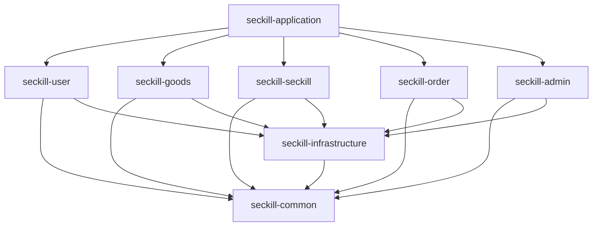
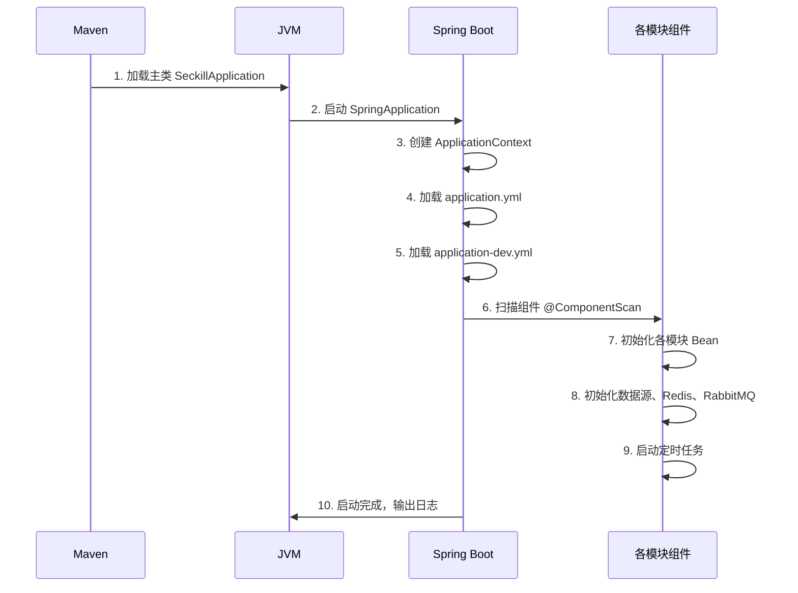

# seckill-application 模块

## 模块概述

`seckill-application` 是电商秒杀系统的**应用启动入口模块**，负责整合所有业务模块并提供统一的启动入口。该模块本身不包含业务逻辑，而是通过依赖所有业务模块，将分散的功能整合为一个完整的可运行应用。

### 核心职责

- 整合所有业务模块（user、goods、seckill、order、admin）
- 提供应用启动入口（Main 方法）
- 加载全局配置文件
- 启用全局功能（如定时任务）
- 输出应用启动信息

---

## 包结构说明

```
seckill-application/
├── src/main/
│   ├── java/com/seckill/application/
│   │   └── SeckillApplication.java    # 应用启动类
│   └── resources/
│       ├── application.yml            # 主配置文件
│       └── application-dev.yml        # 开发环境配置
└── pom.xml                            # 模块依赖配置
```

---

## 启动类详解

### SeckillApplication

```java
@Slf4j
@EnableScheduling
@SpringBootApplication(scanBasePackages = "com.seckill")
public class SeckillApplication {

    public static void main(String[] args) throws UnknownHostException {
        ConfigurableApplicationContext context = SpringApplication.run(SeckillApplication.class, args);
        Environment env = context.getEnvironment();

        String ip = InetAddress.getLocalHost().getHostAddress();
        String port = env.getProperty("server.port", "8080");
        String contextPath = env.getProperty("server.servlet.context-path", "");

        log.info("\n----------------------------------------------------------\n" +
                "\t电商秒杀系统启动成功!\n" +
                "----------------------------------------------------------\n" +
                "\t本地访问: http://localhost:{}{}\n" +
                "\t外部访问: http://{}:{}{}\n" +
                "\tAPI文档: http://{}:{}{}/doc.html\n" +
                "----------------------------------------------------------",
                port, contextPath,
                ip, port, contextPath,
                ip, port, contextPath);
    }
}
```

### 注解说明

| 注解 | 说明 |
|-----|------|
| `@SpringBootApplication` | Spring Boot 应用入口注解，包含 `@Configuration`、`@EnableAutoConfiguration`、`@ComponentScan` |
| `@EnableScheduling` | 启用定时任务功能（用于秒杀预热等） |
| `scanBasePackages = "com.seckill"` | 指定组件扫描基础包，确保所有模块的 Bean 被正确加载 |

---

## 配置详解

### 主配置文件 (application.yml)

```yaml
# 应用配置
server:
  port: 8080                    # 服务端口
  servlet:
    context-path: /             # 上下文路径
  tomcat:
    threads:
      max: 500                  # 最大线程数
      min-spare: 50             # 最小空闲线程
    connection-timeout: 20000   # 连接超时（毫秒）

# Spring 配置
spring:
  application:
    name: seckill-system        # 应用名称
  profiles:
    active: dev                 # 激活的配置文件
  main:
    allow-bean-definition-overriding: true  # 允许 Bean 覆盖
  jackson:
    date-format: yyyy-MM-dd HH:mm:ss
    time-zone: GMT+8
    default-property-inclusion: non_null    # 忽略 null 值

# 日志配置
logging:
  level:
    root: INFO
    com.seckill: DEBUG          # 业务包日志级别
    org.springframework.web: INFO
  pattern:
    console: "%d{yyyy-MM-dd HH:mm:ss.SSS} [%thread] %-5level %logger{50} - %msg%n"
    file: "%d{yyyy-MM-dd HH:mm:ss.SSS} [%thread] %-5level %logger{50} - %msg%n"
  file:
    name: logs/seckill-system.log

# Knife4j API 文档配置
knife4j:
  enable: true
  setting:
    language: zh_cn
    swagger-model-name: 实体类列表
  openapi:
    title: 电商秒杀系统 API 文档
    description: |
      ## 项目介绍
      电商秒杀系统是一个高并发场景下的电商项目，采用 Spring Boot + MyBatis-Plus + Redis + RabbitMQ 技术栈。
      
      ## 主要功能
      - 用户注册/登录/个人信息管理
      - 商品浏览/分类管理
      - 秒杀活动/抢购核心逻辑
      - 订单管理/超时取消
      - 模拟支付
      
      ## 技术亮点
      - Redis 预扣库存 + 消息队列异步下单
      - 分布式锁防止超卖
      - 接口限流防刷
      - 延迟队列实现订单超时取消
    version: v1.0.0
    contact:
      name: Seckill Team
      email: support@seckill.com
    license:
      name: Apache 2.0
      url: https://www.apache.org/licenses/LICENSE-2.0
```

### 开发环境配置 (application-dev.yml)

```yaml
# 开发环境配置

spring:
  # 数据源配置
  datasource:
    type: com.alibaba.druid.pool.DruidDataSource
    driver-class-name: com.mysql.cj.jdbc.Driver
    url: jdbc:mysql://localhost:3306/seckill_db?useUnicode=true&characterEncoding=utf8&serverTimezone=Asia/Shanghai&useSSL=false&allowPublicKeyRetrieval=true
    username: root
    password: your_password
    druid:
      initial-size: 10
      min-idle: 10
      max-active: 100
      max-wait: 60000
      test-while-idle: true
      validation-query: SELECT 1
      filters: stat,wall,slf4j
      stat-view-servlet:
        enabled: true
        url-pattern: /druid/*
        login-username: admin
        login-password: admin

  # Redis 配置
  data:
    redis:
      host: localhost
      port: 6379
      password:
      database: 0
      timeout: 10s
      lettuce:
        pool:
          max-active: 100
          max-idle: 50
          min-idle: 10
          max-wait: 10s

  # RabbitMQ 配置
  rabbitmq:
    host: localhost
    port: 5672
    username: guest
    password: guest
    virtual-host: /
    publisher-confirm-type: correlated
    publisher-returns: true
    listener:
      simple:
        acknowledge-mode: manual
        retry:
          enabled: true
          max-attempts: 3
          initial-interval: 1000
          multiplier: 2
          max-interval: 10000

# MyBatis-Plus 配置
mybatis-plus:
  mapper-locations: classpath*:/mapper/**/*.xml
  type-aliases-package: com.seckill.*.entity
  configuration:
    map-underscore-to-camel-case: true
    cache-enabled: true
    lazy-loading-enabled: true
  global-config:
    db-config:
      id-type: auto
      logic-delete-field: deleted
      logic-delete-value: 1
      logic-not-delete-value: 0

# 自定义配置
seckill:
  jwt:
    secret: seckill-system-jwt-secret-key-2024-secure-key
    access-token-expire: 1800      # 30分钟
    refresh-token-expire: 604800   # 7天
  seckill:
    max-stock-per-activity: 10000  # 单个活动最大库存
    rate-limit-per-user: 1         # 单用户每秒限流次数
    rate-limit-global: 5000        # 全局每秒限流次数
```

---

## 模块依赖关系



---

## 启动流程



---

## 如何启动

### 方式一：IDE 启动

1. 打开 `SeckillApplication.java`
2. 点击 main 方法左侧的运行按钮
3. 查看控制台启动日志

### 方式二：Maven 启动

```bash
# 进入项目根目录
cd seckill-parent

# 编译项目
mvn clean install -DskipTests

# 启动应用
cd seckill-application
mvn spring-boot:run
```

### 方式三：打包后启动

```bash
# 打包
mvn clean package -DskipTests

# 运行 jar 包
java -jar seckill-application/target/seckill-application-1.0.0-SNAPSHOT.jar
```

### 方式四：指定配置文件启动

```bash
# 使用生产环境配置
java -jar seckill-application-1.0.0-SNAPSHOT.jar --spring.profiles.active=prod

# 指定外部配置文件
java -jar seckill-application-1.0.0-SNAPSHOT.jar --spring.config.location=/path/to/config/
```

---

## 访问服务

应用启动成功后，可通过以下地址访问：

| 服务 | 地址 | 说明 |
|-----|------|------|
| 应用首页 | http://localhost:8080 | 应用根路径 |
| API 文档 | http://localhost:8080/doc.html | Knife4j 接口文档 |
| Druid 监控 | http://localhost:8080/druid | 数据库监控（账号：admin/admin） |

---

## 配置多环境

### 环境配置文件

```
resources/
├── application.yml           # 主配置（通用配置）
├── application-dev.yml       # 开发环境
├── application-test.yml      # 测试环境
└── application-prod.yml      # 生产环境
```

### 切换环境

```bash
# 开发环境（默认）
spring.profiles.active=dev

# 测试环境
spring.profiles.active=test

# 生产环境
spring.profiles.active=prod
```

---

## 依赖说明

```xml
<dependencies>
    <!-- 业务模块依赖 -->
    <dependency>
        <groupId>com.seckill</groupId>
        <artifactId>seckill-user</artifactId>
    </dependency>
    <dependency>
        <groupId>com.seckill</groupId>
        <artifactId>seckill-goods</artifactId>
    </dependency>
    <dependency>
        <groupId>com.seckill</groupId>
        <artifactId>seckill-seckill</artifactId>
    </dependency>
    <dependency>
        <groupId>com.seckill</groupId>
        <artifactId>seckill-order</artifactId>
    </dependency>
    <dependency>
        <groupId>com.seckill</groupId>
        <artifactId>seckill-admin</artifactId>
    </dependency>

    <!-- Spring Boot Starter -->
    <dependency>
        <groupId>org.springframework.boot</groupId>
        <artifactId>spring-boot-starter</artifactId>
    </dependency>

    <!-- Spring Boot Web -->
    <dependency>
        <groupId>org.springframework.boot</groupId>
        <artifactId>spring-boot-starter-web</artifactId>
    </dependency>

    <!-- Lombok -->
    <dependency>
        <groupId>org.projectlombok</groupId>
        <artifactId>lombok</artifactId>
    </dependency>

    <!-- Test -->
    <dependency>
        <groupId>org.springframework.boot</groupId>
        <artifactId>spring-boot-starter-test</artifactId>
        <scope>test</scope>
    </dependency>
</dependencies>
```

---

## 打包配置

```xml
<build>
    <plugins>
        <plugin>
            <groupId>org.springframework.boot</groupId>
            <artifactId>spring-boot-maven-plugin</artifactId>
            <version>${spring-boot.version}</version>
            <configuration>
                <mainClass>com.seckill.application.SeckillApplication</mainClass>
            </configuration>
            <executions>
                <execution>
                    <goals>
                        <goal>repackage</goal>
                    </goals>
                </execution>
            </executions>
        </plugin>
    </plugins>
</build>
```

---

## 相关文档

- [父模块文档](../README.md)
- [公共模块文档](../seckill-common/README.md)
- [基础设施模块文档](../seckill-infrastructure/README.md)
- [商品模块文档](../seckill-goods/README.md)
- [订单模块文档](../seckill-order/README.md)
- [管理后台模块文档](../seckill-admin/README.md)
