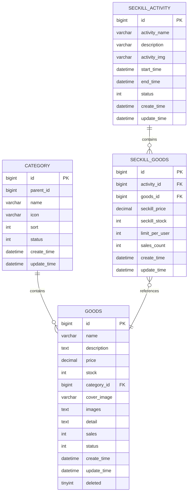
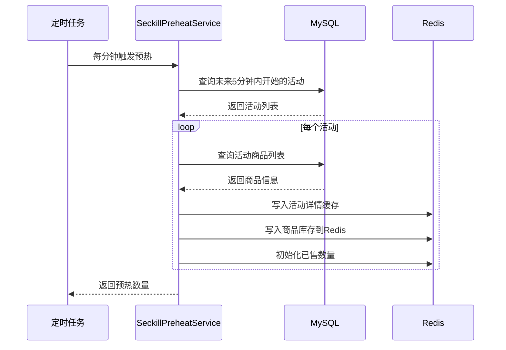

# seckill-goods 模块

## 模块概述

`seckill-goods` 是电商秒杀系统的**商品模块**，负责商品管理、分类管理和秒杀活动管理。该模块同时服务前台用户（商品浏览）和管理后台（商品维护），采用读写分离的缓存策略保证高并发场景下的性能。

### 核心职责

- 商品信息管理（CRUD）
- 商品分类管理（两级分类树）
- 秒杀活动管理
- 秒杀商品关联管理
- 商品缓存策略实现
- 秒杀活动预热

---

## 包结构说明

```
seckill-goods/
├── controller/           # 控制器层
│   ├── CategoryController.java      # 分类接口
│   └── GoodsController.java         # 商品接口
├── dto/                 # 数据传输对象
│   ├── AdminGoodsListResponse.java  # 管理端商品列表响应
│   ├── AdminGoodsSaveRequest.java   # 管理端商品保存请求
│   ├── CategoryRequest.java         # 分类请求
│   ├── CategoryTreeResponse.java    # 分类树响应
│   ├── GoodsDetailResponse.java     # 商品详情响应
│   ├── GoodsListResponse.java       # 商品列表响应
│   ├── GoodsStatusUpdateRequest.java # 商品状态更新请求
│   ├── SeckillActivityListResponse.java  # 秒杀活动列表响应
│   └── SeckillGoodsItemResponse.java     # 秒杀商品项响应
├── entity/              # 实体类
│   ├── Category.java                # 分类实体
│   ├── Goods.java                   # 商品实体
│   ├── SeckillActivity.java         # 秒杀活动实体
│   └── SeckillGoods.java            # 秒杀商品关联实体
├── mapper/              # 数据访问层
│   ├── CategoryMapper.java          # 分类 Mapper
│   ├── GoodsMapper.java             # 商品 Mapper
│   ├── SeckillActivityMapper.java   # 秒杀活动 Mapper
│   └── SeckillGoodsMapper.java      # 秒杀商品 Mapper
├── service/             # 服务层
│   ├── impl/                        # 实现类
│   │   ├── CategoryServiceImpl.java
│   │   └── GoodsServiceImpl.java
│   ├── CategoryService.java         # 分类服务接口
│   ├── GoodsService.java            # 商品服务接口
│   ├── SeckillGoodsService.java     # 秒杀商品服务接口
│   └── SeckillPreheatService.java   # 秒杀预热服务接口
└── task/                # 定时任务
    └── SeckillPreheatTask.java      # 秒杀预热定时任务
```

---

## 实体关系图



---

## 核心功能详解

### 1. 商品管理

#### 商品实体 (Goods)

```java
@Data
@TableName("t_goods")
public class Goods extends BaseEntity {
    private String name;           // 商品名称
    private String description;    // 商品简介
    private BigDecimal price;      // 商品原价
    private Integer stock;         // 普通库存
    private Long categoryId;       // 所属分类ID
    private String coverImage;     // 商品封面图
    private String images;         // 商品轮播图（JSON数组）
    private String detail;         // 商品详情富文本
    private Integer sales;         // 销量
    private Integer status;        // 商品状态：0-下架，1-上架
}
```

#### 商品服务 (GoodsService)

| 方法 | 说明 | 访问权限 |
|-----|------|---------|
| `getPublicGoodsList` | 前台商品列表查询 | 公开 |
| `getPublicGoodsDetail` | 前台商品详情查询 | 公开 |
| `getAdminGoodsList` | 管理端商品列表 | 管理员 |
| `createGoods` | 创建商品 | 管理员 |
| `updateGoods` | 更新商品 | 管理员 |
| `updateGoodsStatus` | 更新商品状态 | 管理员 |
| `deleteGoods` | 删除商品 | 管理员 |

#### 缓存策略

```java
// 商品列表缓存
private static final String GOODS_LIST_KEY_PREFIX = "goods:list:";
private static final long GOODS_LIST_BASE_TTL_SECONDS = 300L;  // 5分钟基础TTL

// 商品详情缓存
private static final String GOODS_DETAIL_KEY_PREFIX = "goods:detail:";
private static final long GOODS_DETAIL_BASE_TTL_SECONDS = 1800L;  // 30分钟基础TTL

// 防缓存雪崩：随机TTL
private long randomGoodsListTtl() {
    return GOODS_LIST_BASE_TTL_SECONDS 
        + ThreadLocalRandom.current().nextLong(GOODS_RANDOM_TTL_SECONDS + 1);
}
```

**缓存更新策略**（Cache Aside 模式）：
1. 读：先读缓存，未命中读数据库，写入缓存
2. 写：先写数据库，再删缓存
3. 使用随机 TTL 防止缓存雪崩

---

### 2. 分类管理

#### 分类实体 (Category)

```java
@Data
@TableName("t_category")
public class Category {
    private Long id;
    private Long parentId;    // 父分类ID，0表示一级分类
    private String name;
    private String icon;
    private Integer sort;     // 排序值
    private Integer status;   // 状态：0-禁用，1-启用
}
```

#### 分类树结构

```
电子产品 (parentId=0)
├── 手机 (parentId=1)
├── 电脑 (parentId=1)
└── 配件 (parentId=1)

服装鞋帽 (parentId=0)
├── 男装 (parentId=5)
├── 女装 (parentId=5)
└── 童装 (parentId=5)
```

#### 分类查询逻辑

```java
// 前台按一级分类查询时，自动展开到全部子分类
private List<Long> resolveCategoryIds(Long categoryId) {
    Category category = categoryMapper.selectById(categoryId);
    
    if (category.getParentId() == null || category.getParentId() == 0L) {
        // 一级分类：查询所有子分类ID
        List<Category> children = categoryMapper.selectList(
            new LambdaQueryWrapper<Category>()
                .eq(Category::getParentId, categoryId)
        );
        // 返回一级分类ID + 所有二级分类ID
        return children.stream()
            .map(Category::getId)
            .collect(Collectors.toList());
    }
    // 二级分类：只返回当前分类ID
    return Collections.singletonList(categoryId);
}
```

---

### 3. 秒杀活动管理

#### 秒杀活动实体 (SeckillActivity)

```java
@Data
@TableName("t_seckill_activity")
public class SeckillActivity {
    private Long id;
    private String activityName;    // 活动名称
    private String description;     // 活动描述
    private String activityImg;     // 活动展示图
    private LocalDateTime startTime; // 开始时间
    private LocalDateTime endTime;   // 结束时间
    private Integer status;         // 活动状态
}
```

#### 秒杀商品关联实体 (SeckillGoods)

```java
@Data
@TableName("t_seckill_goods")
public class SeckillGoods {
    private Long id;
    private Long activityId;        // 所属活动ID
    private Long goodsId;           // 商品ID
    private BigDecimal seckillPrice; // 秒杀价
    private Integer seckillStock;   // 秒杀库存
    private Integer limitPerUser;   // 单用户限购数
    private Integer salesCount;     // 已售数量
}
```

#### 活动状态计算

活动状态是**动态计算**的，结合数据库状态字段和当前时间：

```java
public Integer calculateStatus(SeckillActivity activity) {
    if (activity.getStatus() == 3) {
        return 3;  // 已结束（强制）
    }
    
    LocalDateTime now = LocalDateTime.now();
    if (now.isBefore(activity.getStartTime())) {
        return 0;  // 未开始
    } else if (now.isAfter(activity.getEndTime())) {
        return 2;  // 已结束
    } else {
        return 1;  // 进行中
    }
}
```

---

### 4. 秒杀预热机制

#### 预热流程



#### 预热数据写入 Redis

```java
// 活动详情缓存
redisTemplate.opsForValue().set(
    "seckill:activity:" + activityId,
    JsonUtils.toJson(activity),
    Duration.ofHours(2)
);

// 秒杀库存（原子操作）
redisTemplate.opsForValue().set(
    "seckill:stock:" + activityId + ":" + goodsId,
    String.valueOf(seckillStock)
);

// 已售数量（原子计数）
redisTemplate.opsForValue().set(
    "seckill:sold:" + activityId + ":" + goodsId,
    "0"
);
```

#### 定时任务配置

```java
@Slf4j
@Component
@RequiredArgsConstructor
public class SeckillPreheatTask {
    
    private final SeckillPreheatService seckillPreheatService;

    // 每分钟执行一次
    @Scheduled(cron = "0 */1 * * * ?")
    public void preheatUpcomingActivities() {
        int count = seckillPreheatService.preheatUpcomingActivities();
        if (count > 0) {
            log.info("定时预热完成，预热活动数量={}", count);
        }
    }
}
```

---

## API 接口列表

### 前台接口（公开访问）

| 接口 | 方法 | 说明 |
|-----|------|------|
| `GET /api/goods/list` | getPublicGoodsList | 商品列表查询 |
| `GET /api/goods/{id}` | getPublicGoodsDetail | 商品详情查询 |
| `GET /api/category/tree` | getCategoryTree | 分类树查询 |
| `GET /api/category/list` | getCategoryList | 分类列表查询 |

### 管理端接口（需管理员权限）

| 接口 | 方法 | 说明 |
|-----|------|------|
| `GET /api/admin/goods/list` | getAdminGoodsList | 管理端商品列表 |
| `POST /api/admin/goods` | createGoods | 创建商品 |
| `PUT /api/admin/goods/{id}` | updateGoods | 更新商品 |
| `PUT /api/admin/goods/{id}/status` | updateGoodsStatus | 更新商品状态 |
| `DELETE /api/admin/goods/{id}` | deleteGoods | 删除商品 |
| `GET /api/admin/category/tree` | getAdminCategoryTree | 管理端分类树 |
| `POST /api/admin/category` | createCategory | 创建分类 |
| `PUT /api/admin/category/{id}` | updateCategory | 更新分类 |
| `DELETE /api/admin/category/{id}` | deleteCategory | 删除分类 |

---

## 业务规则

### 商品规则

1. **分类限制**：商品必须挂在二级分类下
2. **默认状态**：新增商品默认下架（status=0）
3. **活动限制**：正在参与秒杀活动的商品不能下架或删除
4. **缓存清理**：商品修改后清理相关缓存（列表、详情、活动）

### 秒杀活动规则

1. **时间窗口**：活动有明确的开始和结束时间
2. **库存隔离**：秒杀库存与普通库存隔离
3. **限购设置**：可配置单用户限购数量
4. **预热机制**：活动开始前自动预热到 Redis

### 缓存规则

1. **列表缓存**：TTL 5分钟 + 随机值（防雪崩）
2. **详情缓存**：TTL 30分钟 + 随机值
3. **负缓存**：查询不存在的商品时缓存空值，TTL 5分钟
4. **缓存更新**：写操作后统一清理相关缓存

---

## 依赖说明

```xml
<dependencies>
    <!-- 内部模块依赖 -->
    <dependency>
        <groupId>com.seckill</groupId>
        <artifactId>seckill-common</artifactId>
    </dependency>
    <dependency>
        <groupId>com.seckill</groupId>
        <artifactId>seckill-infrastructure</artifactId>
    </dependency>
    
    <!-- MyBatis-Plus -->
    <dependency>
        <groupId>com.baomidou</groupId>
        <artifactId>mybatis-plus-spring-boot3-starter</artifactId>
    </dependency>
    
    <!-- Spring Boot Web -->
    <dependency>
        <groupId>org.springframework.boot</groupId>
        <artifactId>spring-boot-starter-web</artifactId>
    </dependency>
    
    <!-- Validation -->
    <dependency>
        <groupId>org.springframework.boot</groupId>
        <artifactId>spring-boot-starter-validation</artifactId>
    </dependency>
    
    <!-- Lombok -->
    <dependency>
        <groupId>org.projectlombok</groupId>
        <artifactId>lombok</artifactId>
    </dependency>
    
    <!-- MapStruct -->
    <dependency>
        <groupId>org.mapstruct</groupId>
        <artifactId>mapstruct</artifactId>
    </dependency>
</dependencies>
```

---

## 测试

### 单元测试

```bash
# 运行商品服务测试
mvn test -Dtest=GoodsServiceUnitTest

# 运行分类服务测试
mvn test -Dtest=CategoryServiceUnitTest

# 运行预热任务测试
mvn test -Dtest=SeckillPreheatTaskUnitTest
```

### 测试覆盖

- 商品 CRUD 操作
- 分类树构建
- 缓存读写
- 秒杀预热逻辑

---

## 相关文档

- [父模块文档](../README.md)
- [公共模块文档](../seckill-common/README.md)
- [基础设施模块文档](../seckill-infrastructure/README.md)
