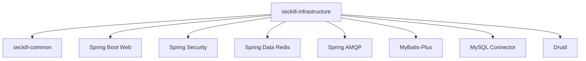

# seckill-infrastructure 模块

## 模块概述

`seckill-infrastructure` 是电商秒杀系统的**基础设施层**，负责配置和管理所有中间件资源，包括数据库连接池、Redis 缓存、RabbitMQ 消息队列等。该模块为上层业务模块提供统一的基础设施访问能力。

### 核心职责

- 数据源配置（MySQL + Druid 连接池）
- Redis 缓存配置
- RabbitMQ 消息队列配置
- MyBatis-Plus 配置
- 安全配置（Spring Security）

---

## 包结构说明

```
seckill-infrastructure/
└── src/main/resources/
    └── application-infrastructure.yml    # 基础设施配置文件
```

> 注：该模块主要提供配置，不包含 Java 代码。所有基础设施相关的 Bean 由 Spring Boot 自动配置创建。

---

## 配置详解

### 1. 数据源配置（MySQL + Druid）

```yaml
spring:
  datasource:
    type: com.alibaba.druid.pool.DruidDataSource
    driver-class-name: com.mysql.cj.jdbc.Driver
    url: jdbc:mysql://localhost:3306/seckill_db?useUnicode=true&characterEncoding=utf8&serverTimezone=Asia/Shanghai&useSSL=false&allowPublicKeyRetrieval=true
    username: root
    password: your_password
```

#### Druid 连接池配置

```yaml
spring:
  datasource:
    druid:
      initial-size: 10              # 初始连接数
      min-idle: 10                  # 最小空闲连接数
      max-active: 100               # 最大活跃连接数
      max-wait: 60000               # 获取连接最大等待时间（毫秒）
      test-while-idle: true         # 空闲时检测连接有效性
      test-on-borrow: false         # 获取连接时不检测
      test-on-return: false         # 归还连接时不检测
      pool-prepared-statements: true                    # 开启 PSCache
      max-pool-prepared-statement-per-connection-size: 20   # PSCache 大小
      validation-query: SELECT 1    # 连接验证 SQL
      validation-query-timeout: 500 # 验证超时时间（毫秒）
      filters: stat,wall,slf4j      # 监控统计、防御 SQL 注入、日志
      connection-properties: druid.stat.mergeSql=true;druid.stat.slowSqlMillis=5000
```

#### Druid 监控配置

```yaml
spring:
  datasource:
    druid:
      web-stat-filter:
        enabled: true
        url-pattern: /*
        exclusions: "*.js,*.gif,*.jpg,*.bmp,*.png,*.css,*.ico,/druid/*"
      stat-view-servlet:
        enabled: true
        url-pattern: /druid/*
        reset-enable: false
        login-username: admin
        login-password: admin
```

**访问地址**: http://localhost:8080/druid

---

### 2. Redis 配置

```yaml
spring:
  data:
    redis:
      host: localhost
      port: 6379
      password:                    # 密码（如需要）
      database: 0                  # 数据库索引
      timeout: 10s                 # 连接超时时间
      lettuce:
        pool:
          max-active: 100          # 最大活跃连接
          max-idle: 50             # 最大空闲连接
          min-idle: 10             # 最小空闲连接
          max-wait: 10s            # 获取连接最大等待时间
```

#### Redis 在秒杀系统中的应用

| 应用场景 | 实现方式 | Key 示例 |
|---------|---------|---------|
| 用户 Token 缓存 | String | `seckill:user:token:{token}` |
| 商品库存缓存 | String | `seckill:goods:stock:{goodsId}` |
| 秒杀库存扣减 | String + Lua | `seckill:stock:{activityId}:{goodsId}` |
| 防重复秒杀 | Set | `seckill:done:{activityId}:{goodsId}` |
| 接口限流 | String（计数器）| `seckill:rate:limit:{uri}:{userId}` |
| 分布式锁 | String + SETNX | `seckill:lock:{resource}` |

---

### 3. RabbitMQ 配置

```yaml
spring:
  rabbitmq:
    host: localhost
    port: 5672
    username: guest
    password: guest
    virtual-host: /
    publisher-confirm-type: correlated    # 开启发布确认
    publisher-returns: true               # 开启消息退回
    listener:
      simple:
        acknowledge-mode: manual          # 手动确认
        retry:
          enabled: true                   # 开启重试
          max-attempts: 3                 # 最大重试次数
          initial-interval: 1000          # 初始重试间隔（毫秒）
          multiplier: 2                   # 间隔倍数
          max-interval: 10000             # 最大重试间隔（毫秒）
```

#### 消息队列应用场景

| 场景 | 队列类型 | 说明 |
|-----|---------|------|
| 订单超时取消 | 延迟队列 | TTL 30 分钟，到期后自动取消订单 |
| 秒杀异步下单 | 普通队列 | 扣减库存后异步创建订单 |
| 支付成功通知 | 普通队列 | 支付成功后异步处理后续逻辑 |

---

### 4. MyBatis-Plus 配置

```yaml
mybatis-plus:
  mapper-locations: classpath*:/mapper/**/*.xml    # Mapper XML 文件位置
  type-aliases-package: com.seckill.*.entity       # 实体类包扫描路径
  configuration:
    map-underscore-to-camel-case: true             # 开启驼峰命名转换
    cache-enabled: true                            # 开启二级缓存
    lazy-loading-enabled: true                     # 开启懒加载
    multiple-result-sets-enabled: true             # 开启多结果集
    use-column-label: true                         # 使用列标签
    use-generated-keys: true                       # 使用 JDBC 生成键
    default-executor-type: simple                  # 默认执行器类型
    default-statement-timeout: 25000               # 默认语句超时（毫秒）
  global-config:
    db-config:
      id-type: auto                                # ID 生成策略
      logic-delete-field: deleted                  # 逻辑删除字段
      logic-delete-value: 1                        # 逻辑删除值
      logic-not-delete-value: 0                    # 逻辑未删除值
      insert-strategy: not_null                    # 插入策略
      update-strategy: not_null                    # 更新策略
      select-strategy: not_null                    # 查询策略
```

#### 配置说明

| 配置项 | 说明 |
|-------|------|
| `map-underscore-to-camel-case` | 自动将数据库下划线命名转换为 Java 驼峰命名 |
| `logic-delete-field` | 指定逻辑删除字段名，实现软删除 |
| `id-type: auto` | 使用数据库自增 ID |
| `insert-strategy: not_null` | 插入时只插入非空字段 |

---

## 模块依赖关系



---

## 使用方式

### 1. 引入依赖

在业务模块的 `pom.xml` 中引入：

```xml
<dependency>
    <groupId>com.seckill</groupId>
    <artifactId>seckill-infrastructure</artifactId>
</dependency>
```

### 2. 配置文件生效

在 `application.yml` 中激活基础设施配置：

```yaml
spring:
  profiles:
    include: infrastructure
```

或在 `application-dev.yml` 中直接配置。

### 3. 使用 RedisTemplate

```java
@Service
@RequiredArgsConstructor
public class GoodsService {
    
    private final StringRedisTemplate redisTemplate;
    
    public void cacheGoods(Long goodsId, Goods goods) {
        String key = RedisKeyConstant.GOODS_INFO + goodsId;
        String json = JsonUtils.toJson(goods);
        redisTemplate.opsForValue().set(key, json, Duration.ofMinutes(30));
    }
}
```

### 4. 使用 RabbitTemplate

```java
@Component
@RequiredArgsConstructor
public class OrderTimeoutProducer {
    
    private final RabbitTemplate rabbitTemplate;
    
    public void send(OrderTimeoutMessage message) {
        rabbitTemplate.convertAndSend(
            RabbitMQConfig.DELAY_EXCHANGE,
            RabbitMQConfig.ORDER_TIMEOUT_ROUTING_KEY,
            message
        );
    }
}
```

### 5. 使用 Mapper

```java
@Mapper
public interface GoodsMapper extends BaseMapper<Goods> {
    // 继承 BaseMapper 获得基础 CRUD 能力
}
```

---

## 性能优化建议

### 数据库连接池优化

```yaml
# 高并发场景建议配置
spring:
  datasource:
    druid:
      initial-size: 20
      min-idle: 20
      max-active: 200
      max-wait: 60000
```

### Redis 连接池优化

```yaml
spring:
  data:
    redis:
      lettuce:
        pool:
          max-active: 200
          max-idle: 100
          min-idle: 20
```

### MyBatis-Plus 优化

```yaml
mybatis-plus:
  configuration:
    default-executor-type: reuse    # 复用 PreparedStatement
  global-config:
    db-config:
      insert-strategy: ignored      # 忽略空值，减少 SQL 字段
```

---

## 监控与运维

### Druid 监控

- **URL**: http://localhost:8080/druid
- **账号**: admin
- **密码**: admin

**监控指标**:
- SQL 监控：执行次数、执行时间、慢 SQL
- URL 监控：请求次数、响应时间
- Session 监控：活跃连接数

### Redis 监控

```bash
# 查看连接数
redis-cli INFO clients

# 查看内存使用
redis-cli INFO memory

# 查看统计信息
redis-cli INFO stats
```

### RabbitMQ 监控

- **管理界面**: http://localhost:15672
- **默认账号**: guest/guest

---

## 故障排查

### 数据库连接问题

```bash
# 检查 Druid 连接池状态
# 访问 /druid/datasource.json

# 常见错误
# 1. Communications link failure - 检查 MySQL 服务是否启动
# 2. Too many connections - 增加 max-active 配置
# 3. Connection timeout - 检查网络连接
```

### Redis 连接问题

```bash
# 测试连接
redis-cli ping

# 常见错误
# 1. Connection refused - 检查 Redis 服务是否启动
# 2. NOAUTH Authentication required - 检查密码配置
```

### RabbitMQ 连接问题

```bash
# 检查服务状态
rabbitmqctl status

# 常见错误
# 1. Connection refused - 检查 RabbitMQ 服务
# 2. ACCESS_REFUSED - 检查用户名密码
```

---

## 相关文档

- [父模块文档](../README.md)
- [公共模块文档](../seckill-common/README.md)
