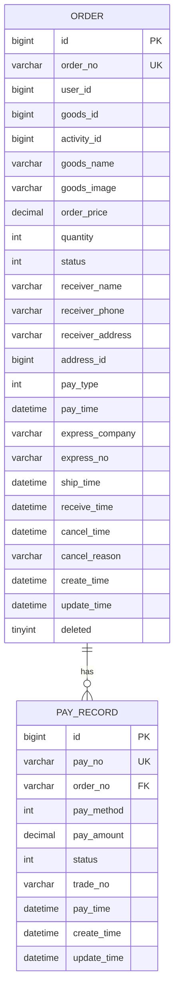
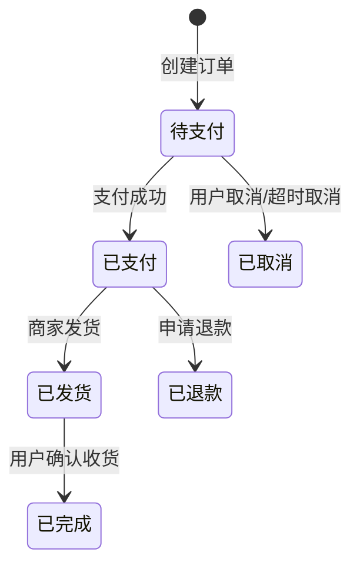
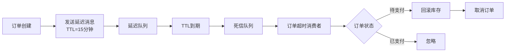
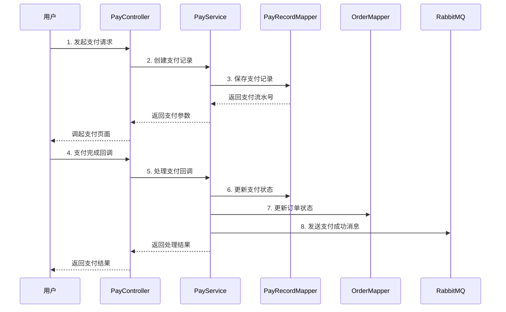

# seckill-order 模块

## 模块概述

`seckill-order` 是电商秒杀系统的**订单模块**，负责订单生命周期管理、支付处理和订单超时取消。该模块通过 RabbitMQ 延迟队列实现订单自动取消，并通过 Lua 脚本保证库存回滚的原子性。

### 核心职责

- 订单创建与管理
- 订单超时自动取消
- 支付处理与回调
- 库存回滚（订单取消/超时）
- 订单状态流转控制

---

## 包结构说明

```
seckill-order/
├── controller/           # 控制器层
│   ├── OrderController.java         # 订单接口
│   └── PayController.java           # 支付接口
├── dto/                 # 数据传输对象
│   ├── CreateSeckillOrderCommand.java   # 创建秒杀订单命令
│   ├── CreateSeckillOrderResult.java    # 创建订单结果
│   ├── OrderDetailResponse.java         # 订单详情响应
│   ├── OrderListResponse.java           # 订单列表响应
│   ├── PayCallbackRequest.java          # 支付回调请求
│   ├── PayCreateRequest.java            # 创建支付请求
│   ├── PayCreateResponse.java           # 创建支付响应
│   └── PayStatusResponse.java           # 支付状态响应
├── entity/              # 实体类
│   ├── Order.java                   # 订单实体
│   └── PayRecord.java               # 支付记录实体
├── mapper/              # 数据访问层
│   ├── OrderMapper.java             # 订单 Mapper
│   └── PayRecordMapper.java         # 支付记录 Mapper
├── mq/                  # 消息队列
│   ├── OrderPaySuccessConsumer.java # 支付成功消费者
│   ├── OrderTimeoutConsumer.java    # 订单超时消费者
│   ├── OrderTimeoutMessage.java     # 订单超时消息
│   └── OrderTimeoutProducer.java    # 订单超时生产者
├── service/             # 服务层
│   ├── impl/                        # 实现类
│   │   ├── OrderServiceImpl.java
│   │   └── PayServiceImpl.java
│   ├── OrderAdminService.java       # 订单管理服务接口
│   ├── OrderCreateService.java      # 订单创建服务接口
│   ├── OrderService.java            # 订单服务接口
│   ├── PayService.java              # 支付服务接口
│   └── StockRollbackService.java    # 库存回滚服务接口
└── resources/
    └── lua/
        └── rollback_stock.lua       # 库存回滚 Lua 脚本
```

---

## 实体关系图



---

## 核心功能详解

### 1. 订单状态流转



#### 订单状态枚举

| 状态码 | 状态 | 说明 |
|-------|------|------|
| 1 | 待支付 | 订单创建成功，等待支付 |
| 2 | 已支付 | 支付成功，等待发货 |
| 3 | 已发货 | 商家已发货 |
| 4 | 已完成 | 用户确认收货 |
| 5 | 已取消 | 订单已取消 |

#### 状态流转规则

```java
public enum OrderStatusEnum {
    PENDING_PAY(1, "待支付"),
    PAID(2, "已支付"),
    SHIPPED(3, "已发货"),
    COMPLETED(4, "已完成"),
    CANCELLED(5, "已取消");
    
    // 检查是否允许取消
    public static boolean allowCancel(Integer status) {
        return PENDING_PAY.getCode().equals(status);
    }
}
```

---

### 2. 订单超时处理

#### 延迟队列架构



#### 订单超时消息

```java
@Data
public class OrderTimeoutMessage implements Serializable {
    private String orderNo;      // 订单编号
    private Long userId;         // 用户ID
    private Long activityId;     // 活动ID
    private Long goodsId;        // 商品ID
    private Integer quantity;    // 购买数量
    private LocalDateTime createTime;  // 订单创建时间
}
```

#### 生产者实现

```java
@Component
@RequiredArgsConstructor
public class OrderTimeoutProducer {
    
    private final RabbitTemplate rabbitTemplate;
    
    public void send(OrderTimeoutMessage message) {
        rabbitTemplate.convertAndSend(
            RabbitMQConfig.DELAY_EXCHANGE,
            RabbitMQConfig.ORDER_TIMEOUT_ROUTING_KEY,
            message
        );
    }
}
```

#### 消费者实现

```java
@Component
@RequiredArgsConstructor
public class OrderTimeoutConsumer {
    
    private final OrderMapper orderMapper;
    private final StockRollbackService stockRollbackService;
    
    @RabbitListener(queues = RabbitMQConfig.ORDER_TIMEOUT_QUEUE)
    public void consume(OrderTimeoutMessage message, Message mqMessage, Channel channel) {
        // 1. 查询订单状态
        Order order = orderMapper.selectByOrderNo(message.getOrderNo());
        
        // 2. 只有待支付订单需要处理
        if (!OrderStatusEnum.PENDING_PAY.getCode().equals(order.getStatus())) {
            channel.basicAck(deliveryTag, false);
            return;
        }
        
        // 3. 回滚库存
        stockRollbackService.rollbackStock(
            message.getActivityId(),
            message.getGoodsId(),
            message.getUserId(),
            message.getQuantity()
        );
        
        // 4. 更新订单状态为已取消
        orderMapper.cancelOrder(
            message.getOrderNo(),
            message.getUserId(),
            OrderStatusEnum.PENDING_PAY.getCode(),
            OrderStatusEnum.CANCELLED.getCode(),
            "订单超时未支付，系统自动取消"
        );
    }
}
```

---

### 3. 库存回滚机制

#### Lua 脚本实现

```lua
-- rollback_stock.lua
local stockKey = KEYS[1]        -- 库存Key
local doneKey = KEYS[2]         -- 已秒杀用户集合Key
local quantity = tonumber(ARGV[1])  -- 回滚数量
local userId = ARGV[2]          -- 用户ID
local doneTtl = tonumber(ARGV[3])   -- 集合过期时间

-- 1. 增加库存
redis.call('INCRBY', stockKey, quantity)

-- 2. 从已秒杀集合中移除用户
redis.call('SREM', doneKey, userId)

-- 3. 设置集合过期时间（防止冷数据长期占用内存）
if doneTtl > 0 then
    redis.call('EXPIRE', doneKey, doneTtl)
end

return 1
```

#### 回滚服务实现

```java
@Service
@RequiredArgsConstructor
public class StockRollbackServiceImpl implements StockRollbackService {
    
    private final StringRedisTemplate redisTemplate;
    
    @Override
    public void rollbackStock(Long activityId, Long goodsId, Long userId, int quantity) {
        String stockKey = RedisKeyConstant.SECKILL_STOCK + activityId + ":" + goodsId;
        String doneKey = RedisKeyConstant.SECKILL_DONE + activityId + ":" + goodsId;
        
        // 执行 Lua 脚本（保证原子性）
        DefaultRedisScript<Long> script = new DefaultRedisScript<>();
        script.setScriptText(ROLLBACK_STOCK_LUA);
        script.setResultType(Long.class);
        
        redisTemplate.execute(script, 
            Arrays.asList(stockKey, doneKey),
            String.valueOf(quantity),
            String.valueOf(userId),
            String.valueOf(3600)  // doneKey TTL 1小时
        );
    }
}
```

#### 回滚时机

| 场景 | 触发方式 | 说明 |
|-----|---------|------|
| 用户主动取消 | 同步调用 | 用户点击取消按钮 |
| 订单超时 | 延迟队列 | TTL 到期自动触发 |
| 支付失败 | 同步调用 | 支付异常时回滚 |

---

### 4. 支付处理

#### 支付流程



#### 支付记录实体

```java
@Data
@TableName("t_pay_record")
public class PayRecord {
    private Long id;
    private String payNo;        // 支付流水号
    private String orderNo;      // 订单编号
    private Integer payMethod;   // 支付方式：1-余额 2-支付宝 3-微信
    private BigDecimal payAmount; // 支付金额
    private Integer status;      // 支付状态：0-待支付 1-已支付 2-失败 3-退款
    private String tradeNo;      // 第三方交易号
    private LocalDateTime payTime; // 支付时间
}
```

#### 幂等性保证

```java
@Service
public class PayServiceImpl implements PayService {
    
    @Override
    @Transactional
    public void handlePayCallback(PayCallbackRequest request) {
        String lockKey = RedisKeyConstant.PAY_CALLBACK_LOCK + request.getOrderNo();
        
        // 1. 分布式锁防止重复处理
        Boolean locked = redisTemplate.opsForValue()
            .setIfAbsent(lockKey, request.getRequestId(), 30, TimeUnit.SECONDS);
        
        if (!Boolean.TRUE.equals(locked)) {
            log.info("支付回调正在处理或已处理，跳过");
            return;
        }
        
        try {
            // 2. 查询支付记录
            PayRecord record = payRecordMapper.selectByPayNo(request.getPayNo());
            
            // 3. 已处理直接返回
            if (record.getStatus() == 1) {
                return;
            }
            
            // 4. 更新支付记录
            record.setStatus(1);
            record.setPayTime(LocalDateTime.now());
            payRecordMapper.updateById(record);
            
            // 5. 更新订单状态
            orderMapper.updateStatus(request.getOrderNo(), OrderStatusEnum.PAID.getCode());
            
        } finally {
            redisTemplate.delete(lockKey);
        }
    }
}
```

---

## API 接口列表

### 订单接口

| 接口 | 方法 | 说明 |
|-----|------|------|
| `GET /api/order/list` | listUserOrders | 查询当前用户订单列表 |
| `GET /api/order/{orderNo}` | getOrderDetail | 查询订单详情 |
| `PUT /api/order/cancel/{orderNo}` | cancelOrder | 取消订单 |

### 支付接口

| 接口 | 方法 | 说明 |
|-----|------|------|
| `POST /api/pay/create` | createPay | 创建支付 |
| `POST /api/pay/callback` | payCallback | 支付回调 |
| `GET /api/pay/status/{orderNo}` | getPayStatus | 查询支付状态 |

---

## 业务规则

### 订单规则

1. **超时时间**：订单创建后 15 分钟内未支付自动取消
2. **取消限制**：只有待支付状态的订单允许取消
3. **库存回滚**：订单取消/超时后自动回滚库存
4. **幂等处理**：支付回调使用分布式锁保证幂等性

### 支付规则

1. **支付方式**：支持余额、支付宝、微信支付
2. **金额校验**：支付金额必须与订单金额一致
3. **重复支付**：已支付订单不允许再次支付
4. **回调处理**：支付回调需要验证签名和幂等性

---

## 依赖说明

```xml
<dependencies>
    <!-- 内部模块依赖 -->
    <dependency>
        <groupId>com.seckill</groupId>
        <artifactId>seckill-common</artifactId>
    </dependency>
    <dependency>
        <groupId>com.seckill</groupId>
        <artifactId>seckill-infrastructure</artifactId>
    </dependency>
    <dependency>
        <groupId>com.seckill</groupId>
        <artifactId>seckill-goods</artifactId>
    </dependency>
    <dependency>
        <groupId>com.seckill</groupId>
        <artifactId>seckill-user</artifactId>
    </dependency>
    
    <!-- Spring Boot Web -->
    <dependency>
        <groupId>org.springframework.boot</groupId>
        <artifactId>spring-boot-starter-web</artifactId>
    </dependency>
    
    <!-- Spring Boot AMQP -->
    <dependency>
        <groupId>org.springframework.boot</groupId>
        <artifactId>spring-boot-starter-amqp</artifactId>
    </dependency>
    
    <!-- Lombok -->
    <dependency>
        <groupId>org.projectlombok</groupId>
        <artifactId>lombok</artifactId>
    </dependency>
    
    <!-- MapStruct -->
    <dependency>
        <groupId>org.mapstruct</groupId>
        <artifactId>mapstruct</artifactId>
    </dependency>
</dependencies>
```

---

## 测试

### 单元测试

```bash
# 运行订单服务测试
mvn test -Dtest=OrderServiceUnitTest

# 运行支付服务测试
mvn test -Dtest=PayServiceUnitTest

# 运行订单超时消费者测试
mvn test -Dtest=OrderTimeoutConsumerUnitTest
```

### 测试覆盖

- 订单 CRUD 操作
- 订单状态流转
- 库存回滚逻辑
- 支付回调处理
- 延迟队列消费

---

## 相关文档

- [父模块文档](../README.md)
- [公共模块文档](../seckill-common/README.md)
- [基础设施模块文档](../seckill-infrastructure/README.md)
- [商品模块文档](../seckill-goods/README.md)
