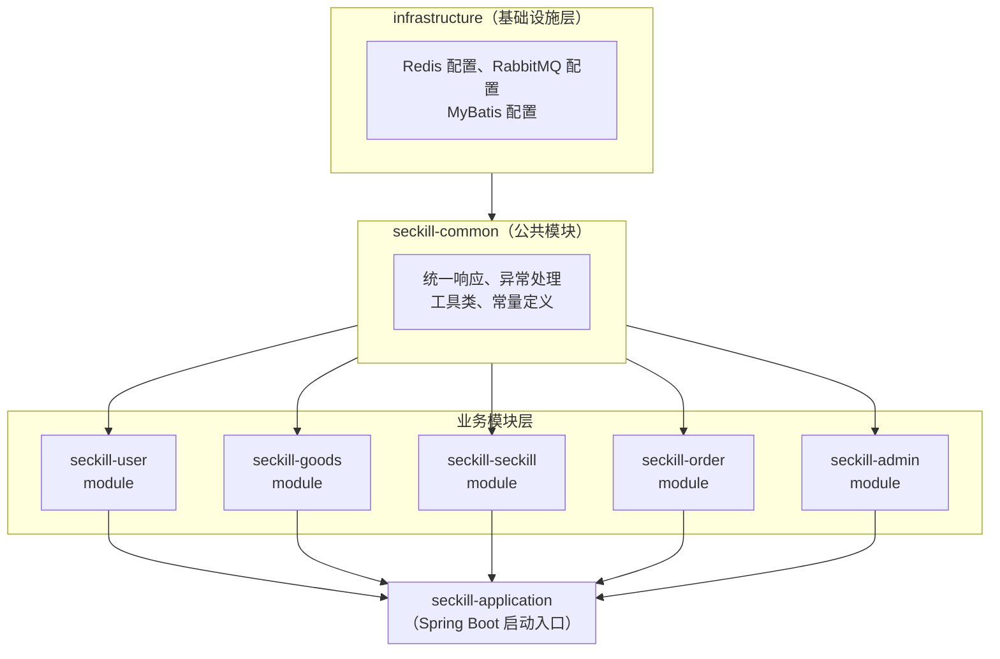

# 电商秒杀系统 — 项目里程碑文档

> **技术栈：** Spring Boot 3.x + MyBatis-Plus 3.5.x + Redis 7.x + RabbitMQ 3.12.x + MySQL 8.0
> **项目定位：** Java 后端实习求职项目
> **总工期：** 5 周（25 个工作日）
> **文档版本：** v1.0
> **更新日期：** 2026-04-23

---

## 一、项目概述

### 1.1 项目背景

秒杀（Flash Sale）是电商领域最具技术挑战性的场景之一：在极短时间内涌入大量并发请求，对系统的**高并发处理能力**、**数据一致性保障**、**服务稳定性**提出了极高要求。掌握秒杀系统的设计与实现，是 Java 后端开发者展示综合技术实力的最佳方式。

本项目从零构建一个完整的电商秒杀系统，涵盖用户认证、商品管理、秒杀核心流程、订单处理、支付模拟、管理后台等完整业务链路，并在实现过程中深入运用 Redis 缓存与分布式锁、RabbitMQ 异步消息队列、接口限流、超时取消等核心中间件技术。

### 1.2 项目目标

| 目标维度 | 具体描述 |
|---------|---------|
| **技术深度** | 熟练运用 Redis（缓存、预扣库存、分布式锁）、RabbitMQ（异步下单、延迟队列）、MySQL 乐观锁等核心技术 |
| **架构能力** | 掌握"单体优先，模块化设计"的开发策略，具备向微服务演进的能力 |
| **工程素养** | 建立完整的开发规范：代码规范、单元测试、压力测试、CI/CD 流程 |
| **面试竞争力** | 每个模块对应可讲解的技术亮点，形成完整的面试项目话术体系 |
| **可演示性** | 提供可运行的完整系统，支持现场演示秒杀流程 |

### 1.3 团队配置

| 角色 | 人数 | 职责 |
|------|------|------|
| 全栈开发 | 1 人 | 负责需求分析、架构设计、前后端开发、测试、部署全流程 |

> **说明：** 本项目为个人实习项目，采用前后端分离架构，后端提供 RESTful API，前端使用简单的 HTML/Vue 页面进行功能验证。

### 1.4 总工期规划

| 阶段 | 周期 | 工作日 |
|------|------|--------|
| 技术准备阶段 | 第 1 周 | 5 天 |
| M1：基础框架搭建 | 第 1 周后半 ~ 第 2 周初 | 3 天 |
| M2：用户模块 | 第 2 周 | 3 天 |
| M3：商品模块 | 第 2 周后半 ~ 第 3 周初 | 3 天 |
| M4：秒杀核心模块 | 第 3 周 | 5 天 |
| M5：订单与支付模块 | 第 3 周后半 ~ 第 4 周初 | 4 天 |
| M6：管理后台 | 第 4 周 | 3 天 |
| M7：测试与优化 | 第 4 周后半 ~ 第 5 周初 | 4 天 |
| M8：项目收尾 | 第 5 周 | 3 天 |
| **合计** | **5 周** | **~33 天（含并行任务，实际约 25 个工作日）** |

---

## 二、开发策略

### 2.1 核心策略：单体优先，模块化设计



**策略要点：**

1. **单体部署优先** — 所有模块打包为一个 JAR，降低部署复杂度，快速验证业务逻辑
2. **Maven 多模块** — 使用 Maven 多模块管理，每个业务模块独立 `artifactId`，模块间通过接口依赖，为后续微服务拆分预留空间
3. **分层架构** — 每个模块内部采用 Controller → Service → Mapper 三层架构
4. **统一基础设施** — Redis、RabbitMQ、MyBatis 等中间件配置集中在基础设施层

### 2.2 开发原则

- **先核心后外围**：优先实现秒杀核心链路（M4），再完善辅助功能
- **测试驱动**：每个模块完成后立即编写单元测试和接口测试
- **持续集成**：使用 Git 分支管理，每个里程碑对应一个 release tag
- **文档同步**：代码注释、API 文档与开发同步更新

### 2.3 向微服务演进的路径

```
单体应用（当前阶段）
    │
    ├── 按模块拆分为独立 Service（Spring Cloud / Dubbo）
    ├── 引入 Nacos 注册中心 + 配置中心
    ├── 引入 Spring Cloud Gateway 网关
    └── 引入 Sentinel 限流熔断
```

> **面试话术：** "项目初期采用单体架构快速迭代，通过 Maven 多模块实现业务解耦。模块间通过接口通信，天然具备向微服务拆分的能力，后续只需引入注册中心和网关即可完成微服务化。"

---

## 三、技术准备阶段（第 1 周）

### 目标描述

搭建完整的开发环境，完成核心技术栈的预研验证，输出可运行的项目脚手架。

### 具体任务列表

**环境搭建：**
- [ ] 安装 JDK 17+，配置 `JAVA_HOME` 环境变量
- [ ] 安装 IntelliJ IDEA，配置 Maven 3.9+、Lombok 插件
- [ ] 安装 MySQL 8.0，创建数据库 `seckill_db`，配置字符集 `utf8mb4`
- [ ] 安装 Redis 7.x，配置持久化（RDB + AOF），设置最大内存策略
- [ ] 安装 RabbitMQ 3.12.x（含 Management 插件），创建 `seckill.exchange`、`seckill.order.queue`、`order.pay.success.queue`、`order.timeout.queue`、`mail.send.queue`
- [ ] 安装 Docker Desktop，编写 `docker-compose.yml` 一键启动中间件
- [ ] 安装 Postman / Apifox，配置接口测试环境
- [ ] 安装 Git，配置 SSH Key，创建远程仓库

**技术预研：**
- [ ] Spring Boot 3.x 基础：自动配置原理、Starter 机制、`application.yml` 配置
- [ ] MyBatis-Plus 3.5.x：代码生成器、条件构造器、分页插件、乐观锁插件
- [ ] Redis 基础操作：String、Hash、List、Set 数据结构，`@Cacheable` 注解缓存
- [ ] Redis 高级特性：Lua 脚本原子操作、`SETNX` 分布式锁、库存预扣方案
- [ ] RabbitMQ 基础：Exchange 类型、Queue 绑定、消息确认机制（ACK/NACK）
- [ ] RabbitMQ 高级特性：死信队列（DLX）、延迟消息实现方案（插件 vs 死信队列）
- [ ] JWT 认证：`jjwt` 库使用、Token 生成与校验、拦截器实现
- [ ] 接口限流方案：基于 Redis + Lua 的令牌桶/漏桶算法

**项目脚手架：**
- [ ] 使用 Spring Initializr 创建 Spring Boot 3.x 项目
- [ ] 配置 Maven 多模块结构（parent + 各子模块）
- [ ] 编写 `pom.xml`，引入所有依赖并管理版本号
- [ ] 编写统一的 API 响应封装类 `Result<T>`
- [ ] 编写全局异常处理器 `GlobalExceptionHandler`
- [ ] 编写自定义业务异常类 `BusinessException`
- [ ] 配置 Swagger / Knife4j API 文档
- [ ] 编写 `.gitignore`，提交初始代码

### 交付物清单

| 交付物 | 说明 |
|--------|------|
| 开发环境 | JDK、MySQL、Redis、RabbitMQ、Docker 全部就绪 |
| `docker-compose.yml` | 一键启动 Redis + RabbitMQ + MySQL |
| 项目脚手架 | Maven 多模块项目，可正常启动 |
| 统一响应 & 异常处理 | `Result<T>`、`GlobalExceptionHandler` |
| 技术预研笔记 | 各中间件核心用法的学习笔记（Markdown） |
| Knife4j 接口文档 | 访问 `http://localhost:8080/doc.html` 可查看 |

### 验收标准

1. `docker-compose up -d` 可一键启动所有中间件
2. 项目脚手架可正常启动，访问 Knife4j 文档页面返回 200
3. 编写一个测试接口 `/api/test`，返回统一格式 `Result.success(data)`
4. 所有环境变量和配置项已抽取到 `application.yml`，无硬编码

### 预估工时

**5 天**

### 依赖的前置里程碑

无（项目起点）

### 面试价值说明

> "在项目初期，我使用 Docker Compose 统一管理 Redis、RabbitMQ、MySQL 等中间件，确保开发环境一致性。项目采用 Maven 多模块架构，通过统一响应封装和全局异常处理提升代码规范性。"

---

## 四、里程碑一：基础框架搭建（M1）

### 目标描述

完成项目的整体架构搭建，包括数据库设计、公共模块开发、基础设施层配置，为后续业务模块开发奠定坚实基础。

### 具体任务列表

**项目结构搭建：**
- [ ] 创建 Maven 多模块项目结构
- [ ] 配置各模块间的依赖关系（common → infrastructure → 各业务模块 → application）
- [ ] 配置 `application.yml`（多环境：dev / test / prod）
- [ ] 配置 MyBatis-Plus：数据源、分页插件、乐观锁插件、自动填充
- [ ] 配置 Redis：连接池（Lettuce）、序列化策略（Jackson）
- [ ] 配置 RabbitMQ：连接工厂、消息转换器（JSON）、确认机制
- [ ] 配置跨域（CORS）、拦截器注册

**数据库设计：**
- [ ] 设计并创建用户表 `t_user`（id、username、password、nickname、phone、avatar、gender、status、login_fail_count、lock_time、create_time、update_time、deleted）
- [ ] 设计并创建商品表 `t_goods`（id、name、description、price、stock、category_id、cover_image、images、status、create_time、update_time、deleted）
- [ ] 设计并创建商品分类表 `t_category`（id、name、sort、parent_id、create_time）
- [ ] 设计并创建秒杀活动表 `t_seckill_activity`（id、activity_name、start_time、end_time、status、create_time、update_time）
- [ ] 设计并创建秒杀商品关联表 `t_seckill_goods`（id、activity_id、goods_id、seckill_price、total_stock、available_stock、create_time、update_time）
- [ ] 设计并创建订单表 `t_order`（id、order_no、user_id、goods_id、activity_id、goods_name、goods_image、order_price、status、receiver_name、receiver_phone、receiver_address、address_id、pay_type、pay_time、create_time、update_time、deleted）
- [ ] 设计并创建收货地址表 `t_address`（id、user_id、receiver_name、receiver_phone、province、city、district、detail_address、is_default、create_time、update_time）
- [ ] 编写数据库初始化 SQL 脚本 `schema.sql`
- [ ] 编写测试数据脚本 `data.sql`

**公共模块开发：**
- [ ] 实现统一响应体 `Result<T>`（code、message、data）
- [ ] 实现全局异常处理器 `GlobalExceptionHandler`
- [ ] 实现自定义异常体系（`BusinessException`、`TokenExpiredException` 等）
- [ ] 实现分页请求封装 `PageRequest`、分页响应封装 `PageResult<T>`
- [ ] 实现通用工具类：`JwtUtils`、`RedisUtils`、`SnowflakeIdWorker`
- [ ] 实现统一枚举类：`OrderStatusEnum`、`ProductStatusEnum`、`ResponseCodeEnum`
- [ ] 实现 MyBatis-Plus 自动填充处理器（create_time、update_time）

**Docker 环境完善：**
- [ ] 完善 `docker-compose.yml`，包含 MySQL、Redis、RabbitMQ
- [ ] 配置 MySQL 数据卷持久化、字符集
- [ ] 配置 Redis 持久化策略
- [ ] 编写环境初始化脚本 `init.sh`

### 交付物清单

| 交付物 | 文件/路径 |
|--------|----------|
| Maven 多模块项目 | `seckill-parent/` 完整目录结构 |
| 数据库脚本 | `sql/schema.sql`、`sql/data.sql` |
| Docker 编排 | `docker-compose.yml`、`init.sh` |
| 公共模块 | `seckill-common/` 下所有工具类和封装 |
| 基础设施配置 | `seckill-infrastructure/` 下 Redis、RabbitMQ、MyBatis 配置 |

### 验收标准

1. 项目可正常编译启动，无报错
2. `schema.sql` 可在 MySQL 中成功执行，所有表创建成功
3. `data.sql` 插入测试数据后，可通过 MyBatis-Plus 查询验证
4. Redis 连接正常，可执行 `SET`/`GET` 操作
5. RabbitMQ 连接正常，可发送和消费测试消息
6. Knife4j 文档页面可正常访问

### 预估工时

**3 天**

### 依赖的前置里程碑

技术准备阶段

### 面试价值说明

> "项目采用 Maven 多模块分层架构，common 模块封装统一响应体和全局异常处理，基础设施层统一管理 Redis、RabbitMQ、MyBatis-Plus 配置。数据库设计遵循三范式，使用雪花算法生成分布式 ID，通过 MyBatis-Plus 自动填充功能管理审计字段。"

---

## 五、里程碑二：用户模块（M2）

### 目标描述

实现完整的用户认证与权限管理体系，包括注册、登录、JWT Token 认证、个人信息管理和收货地址管理。

### 具体任务列表

**用户注册：**
- [ ] 实现注册接口 `POST /api/user/register`
- [ ] 用户名唯一性校验（数据库 + Redis 缓存去重）
- [ ] 密码加密：使用 BCryptPasswordEncoder 加密存储
- [ ] 参数校验：使用 `@Validated` + 自定义校验注解（手机号格式、密码强度）
- [ ] 注册成功后自动登录，返回 JWT Token

**用户登录：**
- [ ] 实现登录接口 `POST /api/user/login`
- [ ] 用户名 + 密码登录，验证 BCrypt 密码
- [ ] 登录成功生成 JWT Token（包含 userId、username，有效期 **30 分钟**）
- [ ] Token 存入 Redis，支持主动失效（踢下线）
- [ ] 实现刷新 Token 接口 `POST /api/user/refresh-token`
- [ ] 实现用户登出接口 `POST /api/user/logout`（使 Token 失效，清除 Redis 缓存）

**JWT 认证拦截器：**
- [ ] 实现 `JwtAuthInterceptor`，拦截需认证的接口
- [ ] 从请求头 `Authorization: Bearer <token>` 中提取 Token
- [ ] 校验 Token 有效性（签名、过期时间、Redis 中是否存在）
- [ ] 将用户信息存入 `ThreadLocal`，供后续业务使用
- [ ] 配置拦截器路径规则（白名单：注册、登录、静态资源）

**个人信息管理：**
- [ ] 实现获取个人信息接口 `GET /api/user/info`
- [ ] 实现修改个人信息接口 `PUT /api/user/info`
- [ ] 实现修改密码接口 `PUT /api/user/password`（需验证旧密码）
- [ ] 实现头像上传接口 `POST /api/user/avatar`（本地存储 / MinIO）

**收货地址管理：**
- [ ] 实现新增地址接口 `POST /api/address`
- [ ] 实现地址列表查询接口 `GET /api/address/list`
- [ ] 实现修改地址接口 `PUT /api/address/{id}`
- [ ] 实现删除地址接口 `DELETE /api/address/{id}`
- [ ] 实现设置默认地址接口 `PUT /api/address/default/{id}`
- [ ] 地址数据权限校验（只能操作自己的地址）

### 交付物清单

| 交付物 | 说明 |
|--------|------|
| 用户模块代码 | `seckill-user/` 下 Controller、Service、Mapper |
| JWT 工具类 | `JwtUtils`（生成、解析、校验 Token） |
| 认证拦截器 | `JwtAuthInterceptor` + `WebMvcConfig` |
| 接口文档 | Knife4j 中用户模块所有接口文档 |
| 单元测试 | Service 层核心逻辑的单元测试 |

### 验收标准

1. 注册 → 登录 → 获取个人信息 全链路通畅
2. 未携带 Token 访问受保护接口，返回 401
3. Token 过期后返回 401，可通过刷新 Token 续期
4. 收货地址 CRUD 操作正常，数据权限隔离
5. 所有接口通过 Postman/Apifox 测试

### 预估工时

**3 天**

### 依赖的前置里程碑

M1（基础框架搭建）

### 面试价值说明

> "用户认证采用 JWT + Redis 双重校验方案：JWT 无状态认证减轻服务端压力，Redis 存储实现 Token 主动失效和续期。密码使用 BCrypt 加密，自带盐值防彩虹表攻击。通过 ThreadLocal 传递用户上下文，避免参数层层传递。"

---

## 六、里程碑三：商品模块（M3）

### 目标描述

实现商品和分类的完整 CRUD 管理，并引入 Redis 缓存提升查询性能，为秒杀模块提供商品数据支撑。

### 具体任务列表

**商品分类管理：**
- [ ] 实现分类树形结构查询接口 `GET /api/category/list`
- [ ] 实现新增分类接口 `POST /api/category`（支持层级）
- [ ] 实现修改分类接口 `PUT /api/category/{id}`
- [ ] 实现删除分类接口 `DELETE /api/category/{id}`（校验是否有子分类或关联商品）

**商品 CRUD：**
- [ ] 实现商品列表查询接口 `GET /api/goods/list`（支持分页、按分类筛选、关键词搜索）
- [ ] 实现商品详情查询接口 `GET /api/goods/{id}`
- [ ] 实现新增商品接口 `POST /api/admin/goods`（仅管理员）
- [ ] 实现修改商品接口 `PUT /api/admin/goods/{id}`（仅管理员）
- [ ] 实现上下架接口 `PUT /api/admin/goods/{id}/status`（仅管理员）
- [ ] 使用 MyBatis-Plus 条件构造器实现动态查询

**Redis 缓存集成：**
- [ ] 商品详情缓存：`@Cacheable` 注解缓存热点商品，TTL 30 分钟
- [ ] 分类树缓存：使用 Redis Hash 存储分类树，减少数据库查询
- [ ] 缓存更新策略：商品修改时主动删除缓存（Cache Aside Pattern）
- [ ] 防止缓存穿透：对不存在的商品缓存空值（TTL 5 分钟）
- [ ] 防止缓存雪崩：TTL 添加随机偏移量（±5 分钟）
- [ ] 封装 `RedisUtils` 工具类，统一缓存操作

**秒杀商品管理：**
- [ ] 实现秒杀商品列表接口 `GET /api/seckill/list`（只展示进行中的秒杀活动）
- [ ] 实现秒杀商品详情接口 `GET /api/seckill/{id}`
- [ ] 秒杀商品数据预热到 Redis（库存信息、商品信息）
- [ ] 实现秒杀商品定时上架（Spring `@Scheduled` 任务）

### 交付物清单

| 交付物 | 说明 |
|--------|------|
| 商品模块代码 | `seckill-goods/` 下完整 CRUD 实现 |
| Redis 缓存层 | 商品缓存、分类缓存、防穿透/雪崩方案 |
| 秒杀商品预热 | 定时任务 + Redis 数据预热脚本 |
| 接口文档 | Knife4j 中商品模块所有接口文档 |

### 验收标准

1. 商品 CRUD 全流程正常
2. 首次查询商品详情走数据库，后续走 Redis 缓存
3. 修改商品后缓存自动失效，下次查询重新加载
4. 查询不存在的商品 ID，不会穿透到数据库
5. 秒杀商品列表只展示当前时间在活动区间内的商品

### 预估工时

**3 天**

### 依赖的前置里程碑

M1（基础框架搭建）、M2（用户模块，需要认证体系）

### 面试价值说明

> "商品查询引入 Redis 缓存，采用 Cache Aside Pattern 策略。针对缓存穿透问题，对不存在的数据缓存空值并设置短 TTL；针对缓存雪崩问题，在 TTL 基础上添加随机偏移量。秒杀商品通过定时任务预热到 Redis，确保秒杀时直接从 Redis 读取库存信息，避免数据库压力。"

---

## 七、里程碑四：秒杀核心模块（M4）

### 目标描述

实现秒杀系统的核心业务逻辑，这是整个项目的技术重点和面试亮点。涵盖 Redis 预扣库存、接口限流、隐藏秒杀地址、RabbitMQ 异步下单等关键技术。

### 具体任务列表

**秒杀流程设计：**
- [ ] 设计秒杀完整流程：用户请求 → 限流 → 验证 → Redis 预扣库存 → RabbitMQ 异步下单 → 返回结果
- [ ] 设计秒杀接口：`POST /api/seckill/do`
- [ ] 设计秒杀结果查询接口：`GET /api/seckill/result/{orderId}`

**接口限流：**
- [ ] 实现基于 Redis + Lua 脚本的令牌桶限流
- [ ] 限流维度：全局 QPS 限制（如 1000/s）+ 单用户 QPS 限制（如 1 次/秒）
- [ ] 限流超限返回友好提示（HTTP 429 Too Many Requests）
- [ ] 封装 `@RateLimiter` 自定义注解 + AOP 切面实现声明式限流

**隐藏秒杀地址：**
- [ ] 秒杀接口不暴露直接 URL，需先获取动态秒杀地址
- [ ] 实现获取秒杀地址接口 `GET /api/seckill/path/{activityId}`（校验活动时间、用户资格）
- [ ] 动态地址使用 MD5(userId + activityId + secretKey) 生成，有效期 5 分钟
- [ ] 秒杀执行接口校验动态地址的合法性

**Redis 预扣库存（核心）：**
- [ ] 使用 Redis String 存储库存：`seckill:stock:{productId}`
- [ ] 使用 Lua 脚本实现原子性库存扣减（判断库存 > 0 才扣减）
- [ ] Lua 脚本逻辑：`GET stock → 判断 > 0 → DECR → 返回成功/失败`
- [ ] 预扣成功后，在 Redis 中记录用户已秒杀（防重复秒杀）：`seckill:user:{userId}:{productId}`
- [ ] 使用 Redis `SETNX` 实现防重复秒杀（一人一单）

**RabbitMQ 异步下单：**
- [ ] 秒杀预扣库存成功后，发送消息到 RabbitMQ
- [ ] 消息内容：userId、productId、orderNo、timestamp
- [ ] 配置消息确认机制（Publisher Confirm + Consumer ACK）
- [ ] 消费者监听队列，执行数据库下单操作
- [ ] 消费失败重试机制：最大重试 3 次，超过后进入死信队列
- [ ] 消息幂等性保障：通过 orderNo 去重，防止重复消费

**数据库下单（消费者端）：**
- [ ] 在数据库中创建秒杀订单记录
- [ ] 使用 MySQL 乐观锁（version 字段）扣减数据库库存
- [ ] 乐观锁失败说明库存不足，记录异常日志
- [ ] 下单成功后更新 Redis 中订单状态

**秒杀结果查询：**
- [ ] 实现轮询查询秒杀结果接口
- [ ] 返回状态：排队中、成功、失败（库存不足 / 重复秒杀）
- [ ] 前端可每 2 秒轮询一次，最多轮询 10 次

### 交付物清单

| 交付物 | 说明 |
|--------|------|
| 秒杀核心代码 | `seckill-seckill/` 下完整秒杀流程实现 |
| Lua 限流脚本 | `scripts/rate_limiter.lua` |
| Lua 库存扣减脚本 | `scripts/deduct_stock.lua` |
| RabbitMQ 配置 | Exchange、Queue、Binding 声明 |
| 消息消费者 | 异步下单消费者 + 死信队列消费者 |
| 限流注解 | `@RateLimiter` + AOP 切面 |

### 验收标准

1. 正常秒杀流程：获取地址 → 执行秒杀 → 查询结果，全链路通畅
2. 重复秒杀被拦截，返回"已参与秒杀"提示
3. 库存为 0 时，后续请求被正确拒绝
4. 限流生效：超过 QPS 阈值返回 429
5. RabbitMQ 消息发送和消费正常，消息确认机制生效
6. 消费失败时重试机制正常，超过重试次数进入死信队列
7. 使用 JMeter 模拟 100 并发，验证库存不超卖

### 预估工时

**5 天**

### 依赖的前置里程碑

M1（基础框架搭建）、M2（用户认证）、M3（商品数据）

### 面试价值说明

> **这是面试中最重要的讲解模块，建议重点准备以下话术：**
>
> 1. **整体架构：** "秒杀采用'前端限流 → Redis 预扣库存 → RabbitMQ 异步下单'的三级缓冲架构，将瞬时高并发请求层层削峰。"
>
> 2. **Redis Lua 脚本：** "库存扣减使用 Lua 脚本保证原子性，避免并发场景下的超卖问题。相比分布式锁方案，Lua 脚本性能更高，单次执行在微秒级别。"
>
> 3. **异步下单：** "Redis 预扣成功后，通过 RabbitMQ 异步下单，将数据库操作从同步链路中剥离。即使数据库处理较慢，用户也能快速收到'排队中'的响应，提升了用户体验。"
>
> 4. **防重复秒杀：** "使用 Redis SETNX 实现一人一单限制，Key 格式为 `seckill:user:{userId}:{productId}`，利用 SETNX 的原子性保证并发安全。"
>
> 5. **消息可靠性：** "通过 Publisher Confirm 确保消息到达 Broker，Consumer ACK 确保消息被正确消费，配合死信队列处理异常消息，实现端到端的消息可靠性保障。"

---

## 八、里程碑五：订单与支付模块（M5）

### 目标描述

实现订单管理和模拟支付功能，重点实现基于 RabbitMQ 延迟队列的订单超时自动取消机制。

### 具体任务列表

**订单管理：**
- [ ] 实现订单列表查询接口 `GET /api/order/list`（分页、按状态筛选）
- [ ] 实现订单详情查询接口 `GET /api/order/{orderNo}`
- [ ] 实现订单取消接口 `PUT /api/order/cancel/{orderNo}`（仅未支付订单）
- [ ] 订单状态流转：待支付 → 已支付 → 已发货 → 已完成 / 已取消
- [ ] 订单数据权限校验（只能查看自己的订单）

**模拟支付：**
- [ ] 实现模拟支付接口 `POST /api/pay/{orderNo}`
- [ ] 支付成功后更新订单状态为"已支付"，记录支付时间
- [ ] 支付成功后发送消息通知（RabbitMQ），触发后续流程
- [ ] 实现支付回调接口（模拟第三方支付回调）

**延迟队列超时取消（核心）：**
- [ ] 使用 RabbitMQ 死信队列实现延迟消息（TTL + DLX 方案）
- [ ] 订单创建后发送延迟消息（TTL = 15 分钟）
- [ ] 延迟消息到期后进入死信队列，触发取消订单逻辑
- [ ] 取消逻辑：校验订单状态（仅取消未支付订单）→ 恢复 Redis 库存 → 恢复数据库库存 → 更新订单状态
- [ ] 考虑备选方案：RabbitMQ 延迟消息插件（`rabbitmq_delayed_message_exchange`）

**库存回滚：**
- [ ] 订单取消/超时后，Redis 库存回滚（`INCR` 操作）
- [ ] 数据库库存回滚（乐观锁 `UPDATE ... SET stock = stock + 1 WHERE ...`）
- [ ] 删除用户已秒杀标记（`DEL seckill:user:{userId}:{productId}`）
- [ ] 库存回滚操作记录日志，便于排查问题

### 交付物清单

| 交付物 | 说明 |
|--------|------|
| 订单模块代码 | `seckill-order/` 下完整订单管理实现 |
| 支付模拟 | 模拟支付接口 + 回调处理 |
| 延迟队列配置 | 死信队列 + TTL 配置 |
| 库存回滚逻辑 | Redis + MySQL 双重回滚 |

### 验收标准

1. 订单创建后可在列表中查询到
2. 模拟支付后订单状态正确更新
3. 创建订单后不支付，15 分钟后订单自动取消
4. 订单取消后 Redis 和 MySQL 库存正确回滚
5. 已支付的订单不会被超时取消逻辑影响
6. 库存回滚后，用户可再次参与秒杀

### 预估工时

**4 天**

### 依赖的前置里程碑

M4（秒杀核心模块，依赖秒杀订单数据）

### 面试价值说明

> "订单超时取消采用 RabbitMQ 死信队列方案：订单创建后发送一条 TTL 为 15 分钟的消息到普通队列，消息过期后自动路由到死信队列，由死信队列的消费者执行取消逻辑。相比定时任务轮询数据库方案，死信队列方案更加精确和高效，避免了无效轮询带来的数据库压力。库存回滚采用 Redis INCR + MySQL 乐观锁双重保障，确保数据一致性。"

---

## 九、里程碑六：管理后台（M6）

### 目标描述

开发管理后台接口，提供商品管理、订单管理、用户管理和数据统计功能，支持 ECharts 图表展示。

### 具体任务列表

**管理员认证：**
- [ ] 实现管理员登录接口 `POST /api/admin/login`
- [ ] 配置管理员角色权限（`SUPER_ADMIN` 超级管理员、`ADMIN` 普通管理员、`OPERATOR` 运营人员）
- [ ] 管理员接口权限校验（自定义注解 `@RequireAdmin` + 拦截器）

**商品管理后台：**
- [ ] 实现商品列表管理接口（分页、搜索、筛选）
- [ ] 实现商品新增/编辑/删除接口
- [ ] 实现商品上下架接口
- [ ] 实现秒杀活动管理（创建活动、设置库存、时间区间）
- [ ] 实现秒杀商品数据预热接口（手动触发 Redis 预热）

**订单管理后台：**
- [ ] 实现订单列表查询接口（支持按状态、时间范围、用户筛选）
- [ ] 实现订单详情查看接口
- [ ] 实现订单发货接口 `PUT /api/admin/order/{orderNo}/ship`
- [ ] 实现订单统计：日订单量、销售额、秒杀转化率

**用户管理后台：**
- [ ] 实现用户列表查询接口（分页）
- [ ] 实现用户详情查看接口
- [ ] 实现用户禁用/启用接口

**数据统计与 ECharts：**
- [ ] 实现销售统计接口 `GET /api/admin/stats/sales`（按日/周/月聚合）
- [ ] 实现秒杀统计接口 `GET /api/admin/stats/seckill`（参与人数、成功率、平均耗时）
- [ ] 实现热销商品排行接口 `GET /api/admin/stats/top-products`
- [ ] 返回 ECharts 需要的 JSON 格式数据（xAxis、series、legend）
- [ ] （可选）集成简单的前端页面展示 ECharts 图表

### 交付物清单

| 交付物 | 说明 |
|--------|------|
| 管理后台代码 | `seckill-admin/` 下所有管理接口 |
| 权限校验 | `@RequireAdmin` 注解 + 拦截器 |
| 统计接口 | 销售统计、秒杀统计、排行榜接口 |
| ECharts 数据格式 | 符合 ECharts 配置的 JSON 响应 |

### 验收标准

1. 管理员可登录并访问所有管理接口
2. 普通用户访问管理接口返回 403
3. 商品、订单、用户的 CRUD 操作正常
4. 统计接口返回正确的聚合数据
5. ECharts 数据格式可在前端正确渲染

### 预估工时

**3 天**

### 依赖的前置里程碑

M2（用户模块）、M3（商品模块）、M5（订单模块）

### 面试价值说明

> "管理后台实现了基于自定义注解的权限校验，通过 `@RequireAdmin` 注解 + 拦截器实现声明式权限控制。数据统计模块使用 MyBatis-Plus 的聚合查询，结合 Redis 缓存统计结果，减少数据库压力。统计接口返回 ECharts 标准格式数据，支持折线图、柱状图、饼图等多种图表展示。"

---

## 十、里程碑七：测试与优化（M7）

### 目标描述

对系统进行全面的单元测试、集成测试和压力测试，发现并修复性能瓶颈，确保系统在高并发场景下的稳定性。

### 具体任务列表

**单元测试：**
- [ ] 使用 JUnit 5 + Mockito 编写 Service 层单元测试
- [ ] 用户模块测试：注册、登录、Token 校验
- [ ] 商品模块测试：CRUD、缓存命中/失效
- [ ] 秒杀模块测试：正常秒杀、重复秒杀、库存不足
- [ ] 订单模块测试：创建订单、取消订单、超时取消
- [ ] 单元测试覆盖率目标：核心业务逻辑 ≥ 80%

**接口集成测试：**
- [ ] 使用 Postman/Apifox 编写接口测试用例集
- [ ] 编写完整的秒杀流程测试用例（注册 → 登录 → 获取地址 → 秒杀 → 查询结果 → 支付）
- [ ] 测试异常场景：Token 过期、参数缺失、权限不足
- [ ] 测试边界场景：库存刚好为 1、并发相同用户、活动未开始/已结束

**压力测试（JMeter）：**
- [ ] 编写 JMeter 秒杀测试计划
- [ ] 配置线程组：1000 线程，5 秒内全部启动
- [ ] 测试场景 1：1000 并发抢 100 件商品，验证不超卖
- [ ] 测试场景 2：10000 并发请求，验证限流效果
- [ ] 测试场景 3：持续 5 分钟的稳态压测，验证系统稳定性
- [ ] 记录关键指标：TPS、QPS、响应时间（P50/P95/P99）、错误率
- [ ] 生成 JMeter 测试报告（HTML 格式）

**性能优化：**
- [ ] 分析压测结果，定位性能瓶颈
- [ ] 优化 Redis 操作：使用 Pipeline 批量执行、减少网络往返
- [ ] 优化数据库查询：添加索引、优化慢查询（`EXPLAIN` 分析）
- [ ] 优化 RabbitMQ：调整 prefetch count、批量消费
- [ ] JVM 调优：分析 GC 日志，调整堆内存参数
- [ ] 连接池优化：调整 HikariCP、Lettuce 连接池参数

**Bug 修复：**
- [ ] 修复压测中发现的并发安全问题
- [ ] 修复内存泄漏或资源未释放问题
- [ ] 修复边界条件导致的异常
- [ ] 修复日志输出不规范问题

### 交付物清单

| 交付物 | 说明 |
|--------|------|
| 单元测试代码 | `src/test/` 下所有测试类 |
| 测试覆盖率报告 | JaCoCo HTML 报告 |
| JMeter 测试计划 | `jmeter/seckill_test.jmx` |
| 压测报告 | `jmeter/report/` HTML 报告 + 关键指标截图 |
| 优化记录 | 性能优化前后对比数据 |

### 验收标准

1. 核心业务逻辑单元测试覆盖率 ≥ 80%
2. 1000 并发抢 100 件商品，最终只生成 100 个订单（零超卖）
3. 限流生效，超过阈值请求被正确拒绝
4. P95 响应时间 < 500ms（秒杀接口）
5. 压测过程中无 OOM、无服务崩溃
6. 所有已知 Bug 已修复

### 预估工时

**4 天**

### 依赖的前置里程碑

M4（秒杀核心）、M5（订单模块）、M6（管理后台）

### 面试价值说明

> "使用 JMeter 进行压力测试，1000 并发抢 100 件商品，通过 Redis Lua 脚本保证库存原子扣减，实现零超卖。压测过程中发现数据库连接池成为瓶颈，通过调整 HikariCP 最大连接数和优化慢查询，将 P95 响应时间从 800ms 优化到 200ms。使用 JaCoCo 生成测试覆盖率报告，核心逻辑覆盖率达到 85%。"

---

## 十一、里程碑八：项目收尾（M8）

### 目标描述

完善项目文档、规范代码质量、完成部署上线准备，并整理面试相关材料。

### 具体任务列表

**文档完善：**
- [ ] 编写项目 README.md（项目介绍、技术栈、架构图、快速开始）
- [ ] 编写数据库设计文档（ER 图、表结构说明、索引设计）
- [ ] 编写 API 接口文档（基于 Knife4j 导出）
- [ ] 编写部署文档（环境要求、部署步骤、配置说明）
- [ ] 绘制系统架构图（使用 draw.io / Excalidraw）
- [ ] 绘制秒杀流程时序图
- [ ] 绘制数据库 ER 图

**代码规范：**
- [ ] 统一代码格式化规则（Google Java Style / Alibaba Java Style）
- [ ] 检查并补充所有类的 Javadoc 注释
- [ ] 检查并补充所有 public 方法的注释
- [ ] 清理无用的 import、未使用的变量
- [ ] 统一日志格式：使用 SLF4J + Logback，规范日志级别
- [ ] 统一异常处理：确保所有异常都有友好提示
- [ ] 代码 Review：逐模块检查代码质量

**部署上线：**
- [ ] 编写 Dockerfile（多阶段构建：编译 → 运行）
- [ ] 完善 docker-compose.yml（应用 + 所有中间件一键启动）
- [ ] 配置生产环境 `application-prod.yml`
- [ ] 编写 Nginx 反向代理配置（可选）
- [ ] 本地部署测试：`docker-compose up` 后系统可正常访问
- [ ] （可选）部署到云服务器（阿里云 / 腾讯云学生机）

**Git 规范：**
- [ ] 整理 Git 提交记录，确保 commit message 规范
- [ ] 为每个里程碑打 Tag（`v0.1-m1-base`、`v0.2-m2-user` 等）
- [ ] 编写 CHANGELOG.md

**面试准备：**
- [ ] 整理项目亮点清单（每个模块 2-3 个技术亮点）
- [ ] 准备项目介绍话术（1 分钟版本 + 3 分钟版本）
- [ ] 准备常见面试问题答案（见第十四章面试准备清单）
- [ ] 准备系统设计扩展问题答案（如：如何支持百万级并发）
- [ ] 录制项目演示视频（可选，3-5 分钟）

### 交付物清单

| 交付物 | 说明 |
|--------|------|
| README.md | 项目介绍、快速开始、架构图 |
| 数据库设计文档 | ER 图 + 表结构说明 |
| 系统架构图 | draw.io / Excalidraw 绘制 |
| 秒杀流程时序图 | 核心流程的可视化展示 |
| Dockerfile + docker-compose.yml | 一键部署配置 |
| CHANGELOG.md | 版本变更记录 |
| Git Tags | 每个里程碑的版本标签 |
| 面试材料 | 项目话术 + 技术亮点清单 |

### 验收标准

1. `docker-compose up` 一键启动后，系统所有功能正常
2. README.md 中的快速开始指南可复现
3. 代码注释完整，无 IDEA 警告
4. 所有里程碑 Tag 已创建
5. 面试话术可流畅讲述（自我测试）

### 预估工时

**3 天**

### 依赖的前置里程碑

M7（测试与优化）

### 面试价值说明

> "项目使用 Docker 实现容器化部署，通过多阶段构建优化镜像体积。代码遵循阿里巴巴 Java 开发规范，使用 JaCoCo 保证测试覆盖率。每个里程碑对应一个 Git Tag，便于版本管理和面试时展示开发节奏。"

---

## 十二、甘特图（文本格式）

```
电商秒杀系统 — 项目甘特图（5 周 / 25 个工作日）
═══════════════════════════════════════════════════════════════════════════════

周次   W1          W2          W3          W4          W5
日期   D1 D2 D3 D4 D5 D6 D7 D8 D9 D10 D11 D12 D13 D14 D15 D16 D17 D18 D19 D20 D21 D22 D23 D24 D25
       ├──────────────────────────────────────────────────────────────────────────────────────────┤

技术准备  ████████████████████████████████████████████████████████████████████████████████████████
       D1 D2 D3 D4 D5

M1 基础框架            ████████████████████████████████████████████████████████████████████████████
       D4 D5 D6

M2 用户模块                    ████████████████████████████████████████████████████████████████████
       D7 D8 D9

M3 商品模块                            ████████████████████████████████████████████████████████████
       D10 D11 D12

M4 秒杀核心                                    ████████████████████████████████████████████████████
       D13 D14 D15 D16 D17

M5 订单支付                                                ████████████████████████████████████████
       D16 D17 D18 D19

M6 管理后台                                                        ████████████████████████████████
       D20 D21 D22

M7 测试优化                                                                ████████████████████████
       D22 D23 D24 D25

M8 项目收尾                                                                        ████████████████████
       D23 D24 D25

═══════════════════════════════════════════════════════════════════════════════

依赖关系：
  技术准备 ──→ M1 ──→ M2 ──→ M3 ──→ M4 ──→ M5 ──→ M6
                                              │       │
                                              └───────┴──→ M7 ──→ M8

并行任务：
  M4 后半段（D16-D17）与 M5 前半段（D16-D17）可并行
  M7 后半段（D24-D25）与 M8 前半段（D23-D24）可并行

关键路径：
  技术准备 → M1 → M2 → M3 → M4 → M5 → M6 → M7 → M8
  （任何关键路径上的延迟都会影响总工期）
```

---

## 十三、风险清单与应对

### 13.1 技术风险

| 风险项 | 风险等级 | 影响 | 应对策略 |
|--------|---------|------|---------|
| Redis Lua 脚本编写错误导致超卖 | **高** | 核心业务逻辑错误 | 1. 充分单元测试覆盖并发场景<br>2. 使用 JMeter 压测验证<br>3. 代码 Review 重点检查 Lua 脚本 |
| RabbitMQ 消息丢失 | **高** | 用户下单成功但订单未创建 | 1. 开启 Publisher Confirm<br>2. 消息持久化（durable）<br>3. 手动 ACK 消费模式<br>4. 死信队列兜底 |
| RabbitMQ 消息重复消费 | **中** | 生成重复订单 | 1. 消费端幂等性设计（orderNo 去重）<br>2. 数据库唯一索引约束 |
| 数据库连接池耗尽 | **中** | 请求超时、服务不可用 | 1. 合理配置 HikariCP 最大连接数<br>2. 异步下单减少数据库操作<br>3. 慢查询优化 |
| Redis 内存不足 | **中** | 缓存失效、性能下降 | 1. 配置 maxmemory-policy 为 allkeys-lru<br>2. 设置合理的 Key TTL<br>3. 监控 Redis 内存使用 |
| Docker 环境兼容性问题 | **低** | 开发环境启动失败 | 1. 使用固定版本镜像<br>2. 编写详细的环境搭建文档<br>3. 准备备用方案（手动安装） |

### 13.2 时间风险

| 风险项 | 风险等级 | 影响 | 应对策略 |
|--------|---------|------|---------|
| M4 秒杀核心模块开发超期 | **高** | 影响后续所有里程碑 | 1. M4 预留 5 天（最长工期）<br>2. 优先实现核心链路，非核心功能降级<br>3. 如超期 2 天以上，简化限流方案 |
| 技术预研时间不足 | **中** | 后续开发频繁踩坑 | 1. 技术准备阶段严格按计划执行<br>2. 优先预研 Redis Lua 和 RabbitMQ<br>3. 遇到问题及时记录，避免重复踩坑 |
| 压测发现问题需要大量修复 | **中** | M7/M8 时间紧张 | 1. 每个模块完成后进行基本并发测试<br>2. 不要把所有问题留到 M7<br>3. M7 预留 4 天缓冲 |
| 学习曲线陡峭 | **中** | 开发效率低 | 1. 优先参考官方文档和成熟方案<br>2. 不要过度设计，先跑通再优化<br>3. 合理利用 AI 辅助编码 |

### 13.3 应对策略总结

1. **核心优先**：M4 秒杀模块是核心，优先保障其按时交付
2. **持续测试**：不要等到 M7 才开始测试，每个模块完成后立即测试
3. **及时降级**：遇到技术难题时，先实现简单方案，后续再优化
4. **文档同步**：边开发边写文档，不要积压到最后
5. **版本管理**：每个里程碑完成后打 Tag，确保可随时回退

---

## 十四、面试准备清单

### 14.1 项目整体类问题

| 问题 | 参考回答要点 |
|------|------------|
| 请介绍一下你的秒杀项目 | 背景 → 技术栈 → 架构设计 → 核心亮点 → 压测数据 |
| 为什么选择这些技术栈 | Spring Boot 生态成熟、Redis 适合高并发缓存、RabbitMQ 异步解耦、MySQL 可靠持久化 |
| 项目的整体架构是怎样的 | 单体优先 + Maven 多模块 + 分层架构 + 中间件基础设施层 |
| 你在项目中遇到的最大挑战 | Redis Lua 脚本保证库存原子扣减 / RabbitMQ 消息可靠性保障 |
| 项目有哪些可以改进的地方 | 微服务化、引入 Sentinel 限流、使用 Seata 分布式事务、前端 Vue 重构 |

### 14.2 用户模块（M2）

| 技术点 | 面试问题 |
|--------|---------|
| JWT 认证 | JWT 的组成（Header、Payload、Signature）？JWT 和 Session 的区别？如何实现 Token 续期？ |
| 密码加密 | BCrypt 的原理？盐值的作用？为什么不用 MD5？ |
| ThreadLocal | ThreadLocal 的原理？内存泄漏问题？如何避免？ |
| 参数校验 | `@Validated` 的原理？自定义校验注解如何实现？ |

### 14.3 商品模块（M3）

| 技术点 | 面试问题 |
|--------|---------|
| Redis 缓存 | 缓存穿透、缓存击穿、缓存雪崩的区别和解决方案？ |
| Cache Aside Pattern | 为什么要先更新数据库再删除缓存？可能出现什么问题？ |
| MyBatis-Plus | MyBatis-Plus 的分页插件原理？乐观锁插件如何实现？ |
| 索引优化 | 什么情况下需要加索引？如何使用 `EXPLAIN` 分析慢查询？ |

### 14.4 秒杀核心模块（M4）— 重点

| 技术点 | 面试问题 |
|--------|---------|
| Redis Lua 脚本 | 为什么用 Lua 脚本？Lua 脚本在 Redis 中如何保证原子性？ |
| 库存扣减 | 除了 Lua 脚本，还有哪些方案？各方案的优缺点？ |
| 分布式锁 | Redis 分布式锁的实现方式？SETNX vs RedLock？锁的超时问题？ |
| 接口限流 | 令牌桶和漏桶算法的区别？为什么选择令牌桶？ |
| RabbitMQ 异步 | 为什么用消息队列？同步下单的问题是什么？ |
| 消息可靠性 | 如何保证消息不丢失？Producer → Broker → Consumer 三个环节 |
| 消息幂等性 | 什么是幂等性？如何实现消费幂等？ |
| 防重复秒杀 | Redis SETNX 的原理？除了 SETNX 还有什么方案？ |
| 隐藏秒杀地址 | 为什么要隐藏秒杀地址？如何实现动态 URL？ |
| 超卖问题 | 什么是超卖？有哪些解决方案？乐观锁 vs 悲观锁？ |

### 14.5 订单与支付模块（M5）

| 技术点 | 面试问题 |
|--------|---------|
| 延迟队列 | RabbitMQ 延迟消息的实现方式？死信队列方案 vs 延迟插件方案？ |
| 死信队列 | 什么是死信？消息进入死信队列的条件？ |
| 库存回滚 | 如何保证库存回滚的可靠性？如果回滚失败怎么办？ |
| 事务一致性 | 订单创建和库存扣减如何保证一致性？最终一致性方案？ |

### 14.6 管理后台（M6）

| 技术点 | 面试问题 |
|--------|---------|
| 权限控制 | RBAC 模型？如何实现接口级权限控制？ |
| 数据统计 | 大量数据统计如何优化？定时聚合 vs 实时计算？ |
| SQL 优化 | GROUP BY 优化？聚合查询的性能问题？ |

### 14.7 测试与优化（M7）

| 技术点 | 面试问题 |
|--------|---------|
| JMeter 压测 | 如何设计压测方案？如何分析压测结果？ |
| JVM 调优 | 常见的 JVM 参数？如何分析 GC 日志？ |
| 连接池优化 | HikariCP 的优势？如何配置连接池参数？ |
| 性能瓶颈定位 | 如何定位性能瓶颈？从哪些维度分析？ |

### 14.8 系统设计扩展问题

| 问题 | 参考回答方向 |
|------|------------|
| 如何支持百万级并发 | CDN 静态化 → Nginx 限流 → 网关层 → 微服务集群 → Redis 集群 → MQ 削峰 → 数据库分库分表 |
| 如何实现分布式事务 | Seata AT 模式 / TCC / 本地消息表 / 最终一致性 |
| Redis 集群方案 | 主从复制 → 哨兵模式 → Cluster 模式，各自适用场景 |
| 如何防止刷单 | 风控系统、设备指纹、行为分析、验证码 |
| 秒杀系统如何水平扩展 | 无状态设计 + Redis 集群 + MQ 分区 + 数据库分片 |

### 14.9 项目介绍话术模板

**1 分钟版本：**

> "我做了一个电商秒杀系统，技术栈是 Spring Boot + Redis + RabbitMQ + MySQL。核心亮点是秒杀流程的三级缓冲架构：前端限流减少无效请求，Redis Lua 脚本原子扣减库存，RabbitMQ 异步下单削峰填谷。压测数据是 1000 并发抢 100 件商品，零超卖，P95 响应时间 200ms。"

**3 分钟版本：**

> "我做了一个完整的电商秒杀系统，采用单体优先、模块化设计的架构策略。整个系统分为用户、商品、秒杀、订单、管理后台五个模块。
>
> 技术上最大的亮点是秒杀核心模块。我设计了三级缓冲架构来应对高并发：第一层是接口限流，基于 Redis + Lua 脚本实现令牌桶算法，控制全局和单用户 QPS；第二层是 Redis 预扣库存，使用 Lua 脚本保证库存扣减的原子性，同时用 SETNX 防止一人多单；第三层是 RabbitMQ 异步下单，将数据库操作从同步链路中剥离，用户只需等待排队结果。
>
> 订单模块实现了基于 RabbitMQ 死信队列的超时取消机制，订单 15 分钟未支付自动取消并回滚库存。
>
> 测试方面，使用 JMeter 进行了 1000 并发的压力测试，验证了零超卖，P95 响应时间 200ms。通过压测发现了数据库连接池瓶颈，优化后性能提升了 4 倍。"

---

## 附录

### A. 推荐学习资源

| 资源 | 说明 |
|------|------|
| 《Redis 设计与实现》 | 深入理解 Redis 数据结构和底层原理 |
| 《RabbitMQ 实战》 | RabbitMQ 核心概念和最佳实践 |
| 《高性能 MySQL》 | MySQL 索引优化和查询优化 |
| Spring Boot 官方文档 | Spring Boot 3.x 新特性和配置参考 |
| MyBatis-Plus 官方文档 | 代码生成器、条件构造器使用指南 |
| JMeter 官方文档 | 压力测试方案设计 |

### B. 开发工具清单

| 工具 | 用途 |
|------|------|
| IntelliJ IDEA | Java IDE |
| Docker Desktop | 容器化部署 |
| Postman / Apifox | 接口测试 |
| JMeter | 压力测试 |
| Git + GitHub | 版本管理 |
| Knife4j | API 文档 |
| draw.io / Excalidraw | 架构图绘制 |
| Navicat / DBeaver | 数据库管理 |

### C. 版本规划

| Tag | 里程碑 | 说明 |
|-----|--------|------|
| `v0.1.0` | M1 | 基础框架搭建完成 |
| `v0.2.0` | M2 | 用户模块完成 |
| `v0.3.0` | M3 | 商品模块完成 |
| `v0.4.0` | M4 | 秒杀核心完成（核心版本） |
| `v0.5.0` | M5 | 订单支付完成 |
| `v0.6.0` | M6 | 管理后台完成 |
| `v0.7.0` | M7 | 测试优化完成 |
| `v1.0.0` | M8 | 项目收尾，正式发布 |

---

> **文档维护说明：** 本文档随项目开发持续更新，每个里程碑完成后更新对应章节的实际工时和遇到的问题。
