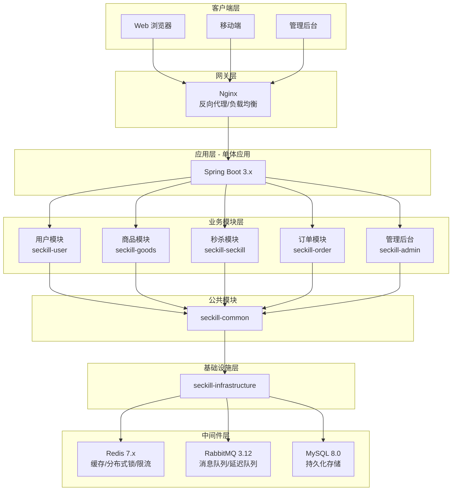
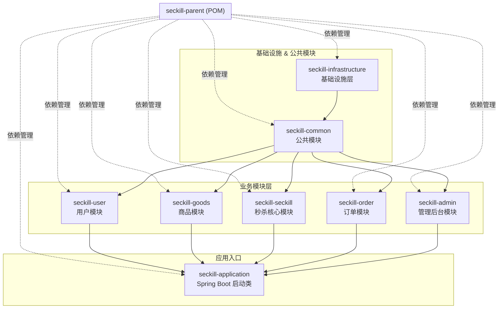
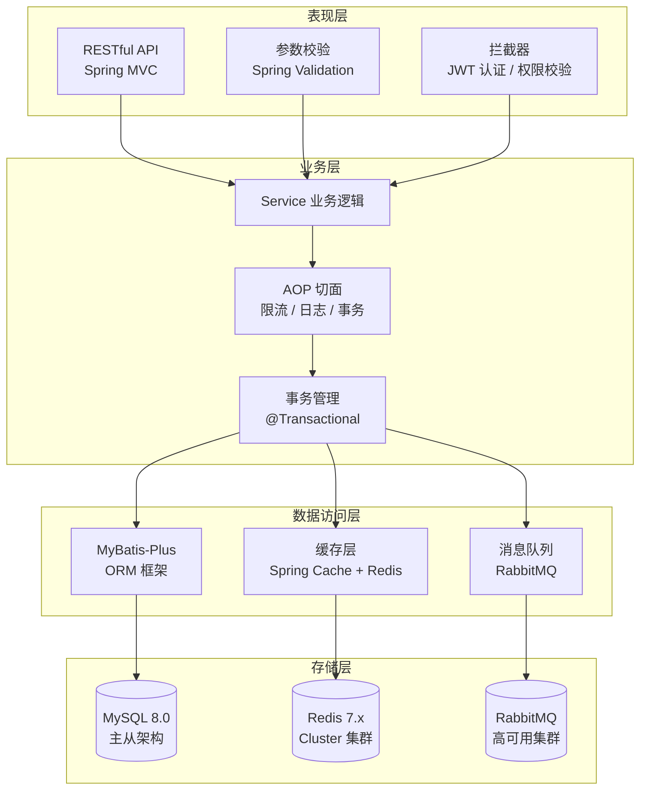
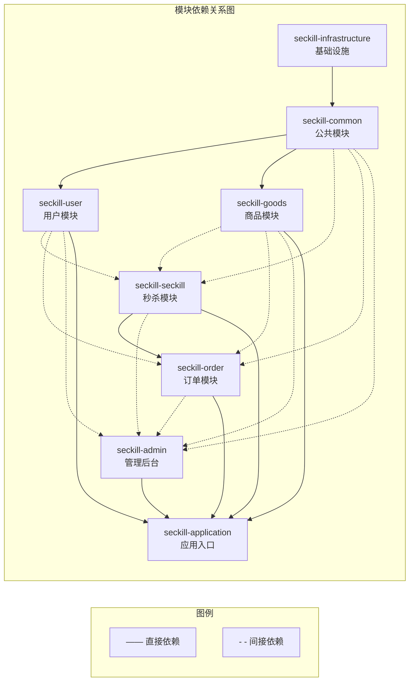
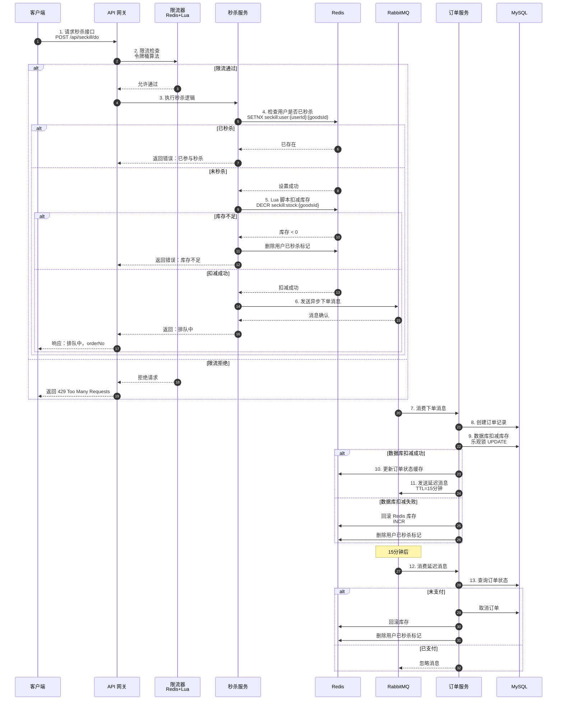
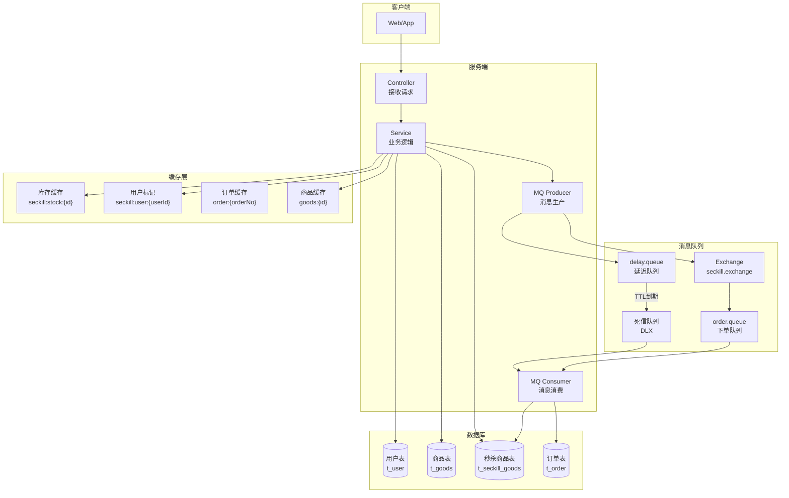
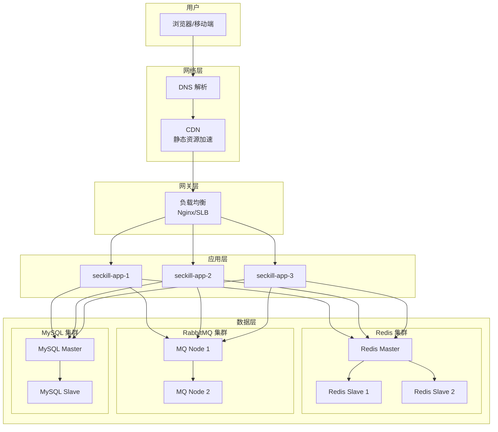

# 电商秒杀系统 — 架构设计文档

> **版本：** v1.0  
> **日期：** 2026-04-24  
> **技术栈：** Spring Boot 3.x + MyBatis-Plus + Redis + RabbitMQ + MySQL

---

## 目录

1. [整体架构概览](#1-整体架构概览)
2. [Maven 多模块架构](#2-maven-多模块架构)
3. [技术栈架构](#3-技术栈架构)
4. [业务模块依赖关系](#4-业务模块依赖关系)
5. [秒杀核心流程](#5-秒杀核心流程)
6. [数据流转架构](#6-数据流转架构)
7. [部署架构](#7-部署架构)

---

## 1. 整体架构概览

---

## 2. Maven 多模块架构

### 模块说明

| 模块 | 类型 | 职责 |
|------|------|------|
| seckill-parent | Parent POM | 统一依赖管理、版本控制 |
| seckill-infrastructure | Jar | Redis、RabbitMQ、MyBatis-Plus 配置 |
| seckill-common | Jar | 统一响应、异常处理、工具类、常量 |
| seckill-user | Jar | 用户注册、登录、JWT 认证、个人信息 |
| seckill-goods | Jar | 商品管理、分类管理、库存管理 |
| seckill-seckill | Jar | 秒杀核心：限流、预扣库存、异步下单 |
| seckill-order | Jar | 订单管理、支付模拟、超时取消 |
| seckill-admin | Jar | 管理后台、数据统计、权限控制 |
| seckill-application | Jar | Spring Boot 启动入口，聚合所有模块 |

---

## 3. 技术栈架构

---

## 4. 业务模块依赖关系

### 依赖说明

| 模块 | 依赖模块 | 说明 |
|------|----------|------|
| seckill-user | seckill-common | 基础依赖 |
| seckill-goods | seckill-common | 基础依赖 |
| seckill-seckill | seckill-common, seckill-user, seckill-goods | 需要用户认证和商品数据 |
| seckill-order | seckill-common, seckill-user, seckill-goods, seckill-seckill | 依赖秒杀模块生成订单 |
| seckill-admin | seckill-common, seckill-user, seckill-goods, seckill-order | 管理后台依赖所有业务模块 |
| seckill-application | 所有模块 | 聚合所有模块作为启动入口 |

---

## 5. 秒杀核心流程

---

## 6. 数据流转架构

---

## 7. 部署架构

### 部署说明

| 层级 | 组件 | 部署方式 | 高可用方案 |
|------|------|----------|------------|
| 网络层 | DNS | 云解析 | 多线路解析 |
| 网络层 | CDN | 云 CDN | 多节点加速 |
| 网关层 | Nginx | 多台部署 | Keepalived + VIP |
| 应用层 | Spring Boot | Docker 容器 | 多实例负载均衡 |
| 缓存层 | Redis | Docker / 云托管 | 主从 + 哨兵模式 |
| 消息层 | RabbitMQ | Docker 集群 | 镜像队列集群 |
| 数据库 | MySQL | Docker / 云托管 | 主从复制 + 读写分离 |

---

## 附录：技术版本清单

| 技术 | 版本 | 用途 |
|------|------|------|
| Java | 17 | 开发语言 |
| Spring Boot | 3.2.5 | 应用框架 |
| MyBatis-Plus | 3.5.5 | ORM 框架 |
| MySQL | 8.0.33 | 关系型数据库 |
| Redis | 7.x | 缓存/分布式锁 |
| RabbitMQ | 3.12.x | 消息队列 |
| JWT | 0.12.3 | 认证令牌 |
| Knife4j | 4.4.0 | API 文档 |
| Lombok | 1.18.30 | 代码简化 |
| Hutool | 5.8.25 | 工具库 |
